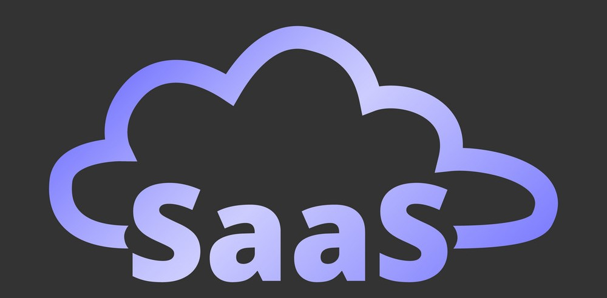

<br>
<br>


# ⚒️  `SAAS 를 알아보자`

<br>

* **정의**
* **종류**
* **B2B**
* **인재상**

<br>

> 정의

```
서비스로서의 소프트웨어를 의미

소프트웨어가 중앙에서 호스팅,
인터넷을 통해 고객에게 제공되는 
소프트웨어 라이센스 및 제공 모델

사용자는 자신의 서버나 컴퓨터에 로컬로 소프트웨어를 구매

설치하는 대신 웹 브라우저나 기타 클라이언트 애플리케이션을 통해 소프트웨어에 액세스
```
<br>
<br>

> 종류

<br>

- 고객 관계 관리 (CRM)
- 전사적 자원 관리 (ERP)
- 프로젝트 관리 소프트웨어
- 협업 및 커뮤니케이션 도구
- HRM 소프트웨어
- 회계 및 재무 소프트웨어

<br>

&nbsp;&nbsp;&nbsp;&nbsp;`고객 관계 관리 (CRM)`
```
이 플랫폼은 기업이 고객 상호 작용, 
판매 프로세스 및 고객 데이터를 관리하는 데 도움
```
<br>

&nbsp;&nbsp;&nbsp;&nbsp;`전사적 자원 관리 (ERP)`
```
재무, 인적 자원, 재고 관리, 
공급망 운영과 같은 다양한 비즈니스 프로세스를 통합
```
<br>

&nbsp;&nbsp;&nbsp;&nbsp;`프로젝트 관리 소프트웨어`
```
프로젝트 계획, 추적 및 협업을 지원하여 
팀 내 효과적인 관리 및 커뮤니케이션을 보장
```
<br>

&nbsp;&nbsp;&nbsp;&nbsp;`협업 및 커뮤니케이션 도구`
```
조직 내외에서 팀 구성원 간의 실시간 커뮤니케이션, 
파일 공유 및 협업을 촉진
```
<br>

&nbsp;&nbsp;&nbsp;&nbsp;`HRM 소프트웨어`
```
직원 관리, 채용, 온보딩, 급여 및 기타 
HR 관련 작업을 지원
```
<br>

&nbsp;&nbsp;&nbsp;&nbsp;`회계 및 재무 소프트웨어`
```
기업은 송장 발행, 예산 책정, 비용 추적 및 재무 보고를 
포함한 재무 프로세스를 관리
```
<br>

<br>

> B2B

<br>

```
SaaS 제품이 개인 소비자가 아닌 
기업 및 조직을 주로 대상으로 하는 특성을 나타냄 

SaaS 공급자는 종종 확장 가능
사용자 지정이 가능하며 
비용 효율적인 솔루션을 제공
다른 비즈니스의 요구 사항을 충족

기업은 SaaS 제품을 활용하여 
운영을 간소화하고 생산성을 향상하며 
인프라 비용을 절감
```
<br>
<br>

> 인재상

<br>

- 웹 개발
- 프레임워크 및 라이브러리
- API 통합
- 테스트 및 디버깅
- CI / CD
- 보안
- 반응형 디자인
- 성능 최적화 
- 협업 및 버전 제어
- 지속적인 학습