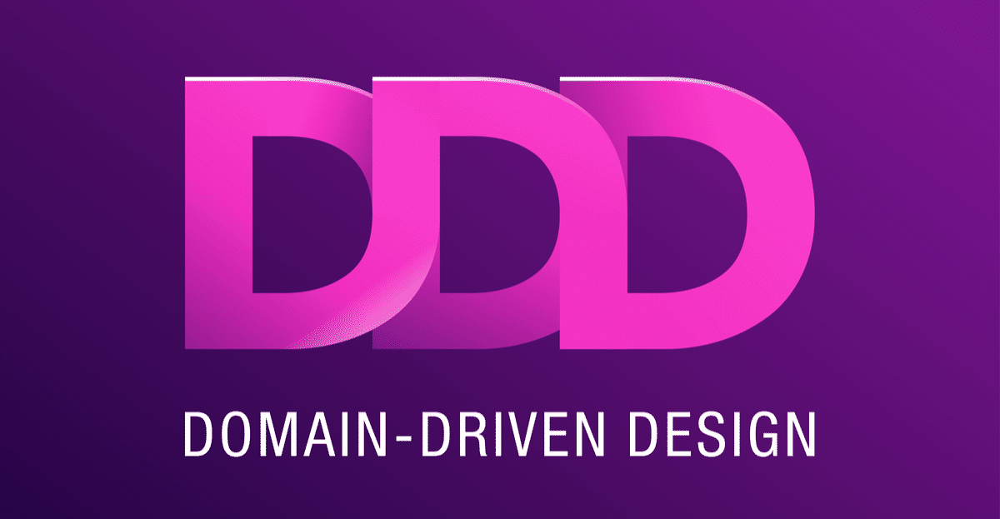

<br>
<br>


# ⚒️  `DDD 알아보자`

<br>


* **정의**
* **절차**
* **장·단점**
* **정리**

<br>

> 정의

<br>

&nbsp;&nbsp;`Domain Driven Design ( 도메인 주도 설계 )`
```
도메인 전문가와 개발자 간의 
협력을 강조하여 문제 

도메인에 대한 이해를 공유하는 
소프트웨어 개발 접근 방식

주요 목표는 도메인을 
정확하게 나타내는 소프트웨어 모델을 생성하여 
더 쉽게 추론하고 유지 관리할 수 있도록 하는 것
```

<br>

> 절차

<br>

- 도메인 탐구
- 유비쿼터스 언어 정의
- Bounded Context 정의
- 도메인 모델링
- 도메인 서비스
- 에그리게이트
- 리포지토리
- 응용 서비스
- 인프라스트럭처 계층

<br>

&nbsp;&nbsp;&nbsp;`도메인 탐구`
```
도메인 전문가와의 협업을 통해 
도메인을 탐구하고 이해

도메인의 핵심 개념, 규칙, 
프로세스 등을 파악
```
<br>

&nbsp;&nbsp;&nbsp;`유비쿼터스 언어 정의`
```
도메인 전문가와 개발자 간에 
공통된 언어를 사용

도메인 용어를 정의하고 
이를 코드와 문서화에 반영
```
<br>

&nbsp;&nbsp;&nbsp;`Bounded Context 정의`
```
도메인을 작은 단위로 나누고, 
각 단위를 Bounded Context로 정의

Bounded Context는 
경계를 가진 도메인 모델의 한 부분
```
<br>

&nbsp;&nbsp;&nbsp;`도메인 모델링`
```
Bounded Context 내에서 
도메인 모델을 설계

도메인 모델은 도메인의 
핵심 개념과 규칙을 객체로 표현한 것

TypeScript를 사용하여 
도메인 객체, 애그리게이트, 값 객체 등을 정의
```
<br>

&nbsp;&nbsp;&nbsp;`도메인 서비스`
```
도메인의 핵심 로직을 도메인 서비스로 추출

특정 도메인 객체에 종속되지 않고, 
도메인 전체에서 공유되는 로직을 캡슐화
```
<br>

&nbsp;&nbsp;&nbsp;`에그리게이트`
```
도메인 객체들의 그룹을 애그리게이트로 정의

도메인 일관성을 보장하고, 트랜잭션 경계를 가짐
```
<br>

&nbsp;&nbsp;&nbsp;`리포지토리`
```
도메인 객체와 애그리게이트를 
영속화하기 위한 리포지토리를 구현

TypeScript를 사용하여 
리포지토리 인터페이스와 구현체를 작성
```
<br>

&nbsp;&nbsp;&nbsp;`응용 서비스`
```
사용자 요청을 처리하는 응용 서비스를 구현

응용 서비스는 도메인 객체와 
리포지토리를 사용하여 비즈니스 로직을 수행
```
<br>

&nbsp;&nbsp;&nbsp;`인프라스트럭처 계층`
```
인프라스트럭처 계층은 
데이터베이스, 외부 서비스와의 통신, 
파일 시스템 등과 같은 외부 자원과의 
상호 작용을 담당

인프라스트럭처 코드는 도메인 코드에 종속되면 안됨
```

<br>
<br>

> 장·단점

<br>

<br>

&nbsp;&nbsp;&nbsp;&nbsp;`장점` 
```
* 도메인 중심의 설계로 복잡성을 관리 가능

* 도메인의 핵심 개념과 규칙을 명확하게 
  표현 가능

* 도메인 모델을 이해하기 쉽고 유지보수하기 쉬움

* 도메인 전문가와의 협업을 강화하여 
  비즈니스 요구사항을 정확히 반영
```
<br>

&nbsp;&nbsp;&nbsp;&nbsp;`단점` 
```
* 초기 개발 시간이 오래 걸릴 수 있음

* 초기 설계 단계에서 도메인을 
  완전히 이해하기 어려울 수 있음

* 조직의 전체적인 기술적인 이해와 
  도메인 지식을 필요
```
<br>
<br>


> 정리
<br>

```
초기에 시간과 노력이 필요
장기적으로는 유지보수성과 확장성을 개선

비즈니스 요구사항에 
더 잘 부응하는 소프트웨어를 구축

설계할 때에는 도메인 모델링에 집중

비즈니스 로직을 도메인 객체와 서비스로 
적절하게 분리하는 것이 중요


Typescript의 강력한 타입 시스템을 사용하여 
도메인 객체와 관련된 데이터의 타입을 
명확하게 지정 가능

Next.js의 정적 페이지 생성(SSG)이나 
서버 사이드 렌더링(SSR)과 
같은 기능을 활용하여 최적의 성능을 추구
```