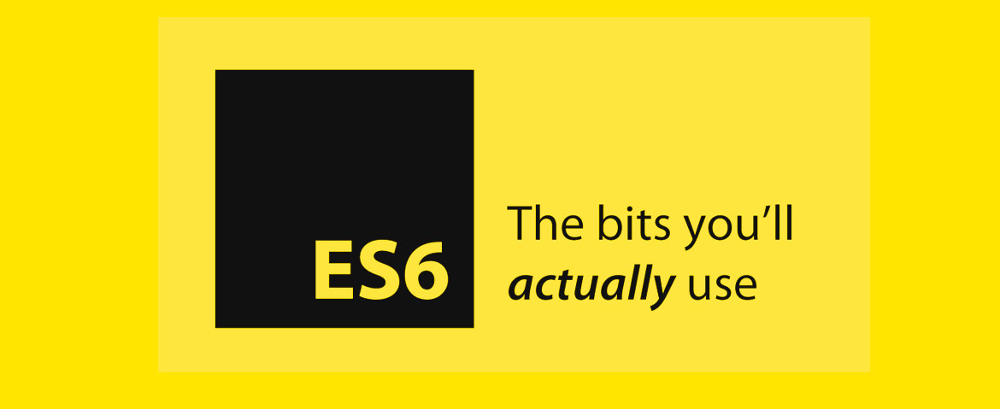

<br>
<br>


# ⚒️  `Arrow Function 알아보자`

<br>

* **정의**
* **문법**
* **코드**

<br>

> 정의


```
JavaScript에서 함수를 더 간결하고 
표현적으로 작성할 수 있는 새로운 문법

기존의 함수 표현식에 비해 
더 짧고 간결한 문법을 제공
```
<br>

> 문법

<br>

- 간결한 문법
- 암묵적인 반환
- Lexical 'this' 바인딩 
- arguments 객체 없음 
- new 바인딩 없음 
    
<br>

&nbsp;&nbsp;&nbsp;&nbsp;`간결한 문법`

```
일반 함수에 비해 더 짧고 간결한 문법
"=>" (뚱뚱한 화살표) 기호로 표시
```    
<br>

&nbsp;&nbsp;&nbsp;&nbsp;`암묵적인 반환`

```
본문이 단일 표현식으로 구성되어 있다면
return 문을 명시적으로 사용하지 않아도 됨
```  
<br>

&nbsp;&nbsp;&nbsp;&nbsp;`Lexical 'this' 바인딩`

```
자체적인 "this" 값을 바인딩 X
대신, 정의된 주변 문맥에서 "this" 값을 상속

이러한 동작은 "this" 키워드와 관련된 
혼동과 불일치를 방지하는 데 도움
```  
<br>

&nbsp;&nbsp;&nbsp;&nbsp;`arguments 객체 없음`

```
자체적인 "arguments" 객체가 없음 

전달된 인수에 접근해야 할 경우, 
주변 범위의 "arguments" 객체를 사용
```  
<br>

&nbsp;&nbsp;&nbsp;&nbsp;`new 바인딩 없음`

```
"new" 키워드와 함께 생성자로 사용 불가능

새로운 객체를 생성하기 위해 필요한 
내부 [[Construct]] 메소드가 없기 때문
```

<br>

> 코드


```
function greet(name) {
  return "Hello, " + name;
}

const greetArrow = (name) => "Hello, " + name;

console.log(greet("John")); 
  // 출력: Hello, John

console.log(greetArrow("John")); 
  // 출력: Hello, John
```
<br>