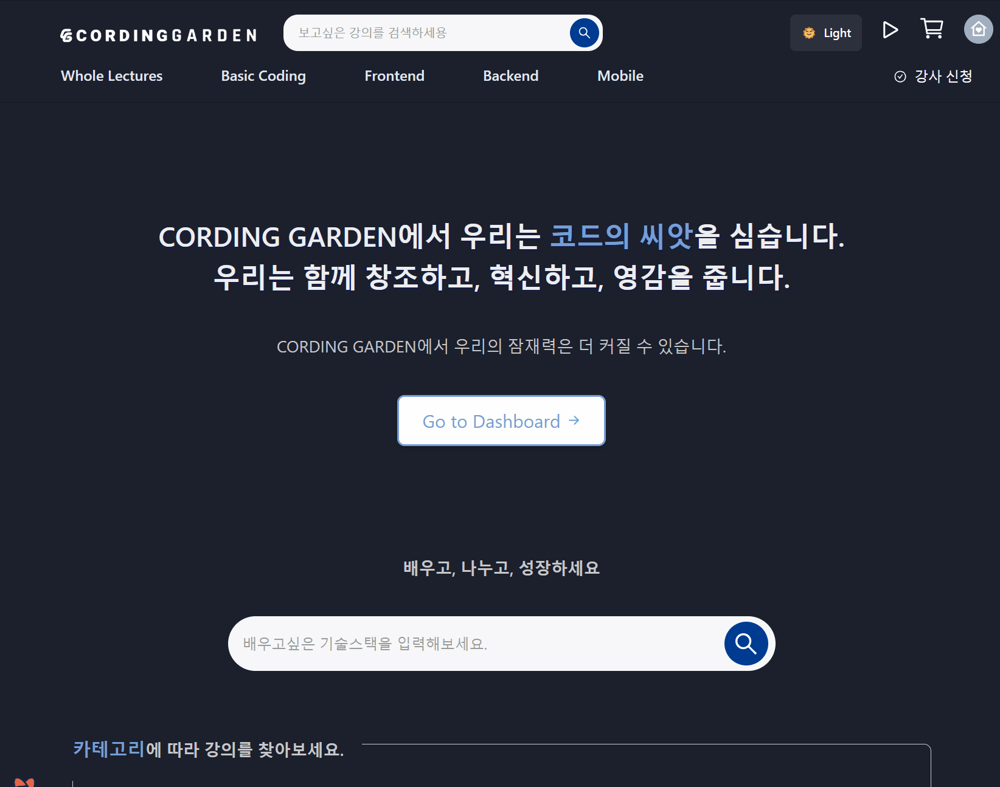
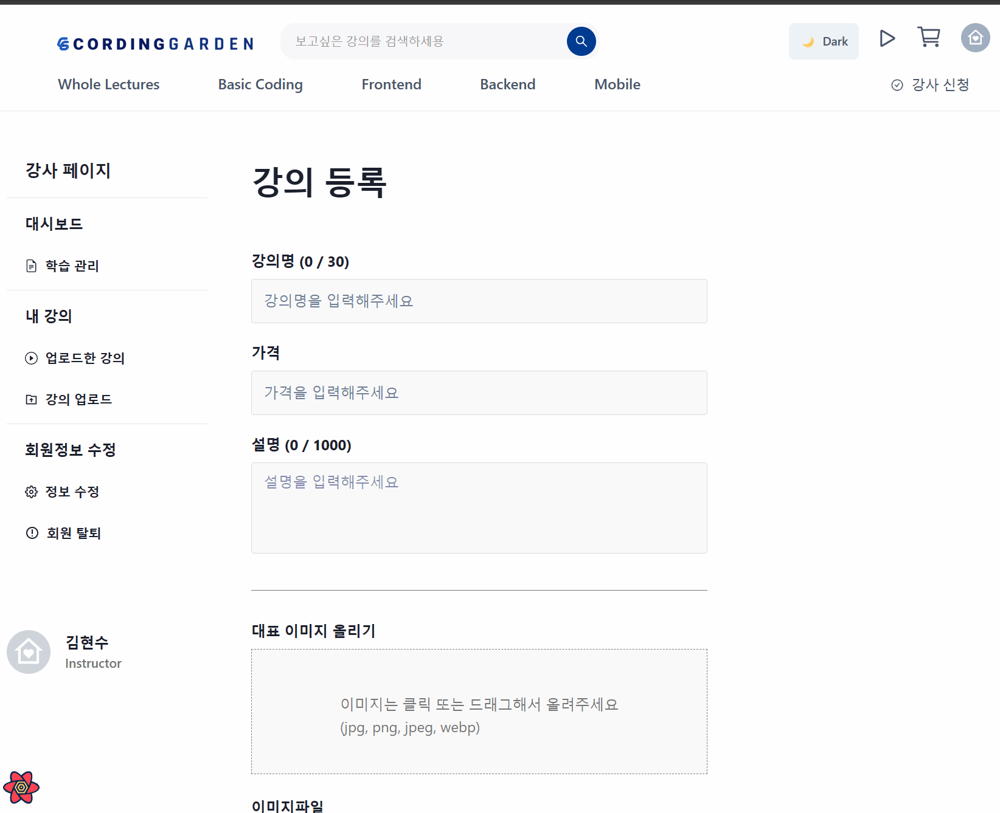

<br>
<br>


# ⚒️  `Coding Garden 소개`

<br>


* **정의**
* **기능목록**
* **KPT 회고**

<br>


> 소개

```
유저별 대시보드 제공에 중점을 둔 강의 사이트
```
<br>
<br>

- ## `프로젝트 이미지`







<br>
<br>

## 🔧 기능목록

<br>

### &nbsp;&nbsp;&nbsp;**`🔗 라우팅`**<br>

### &nbsp;&nbsp;&nbsp;**`🔗 Test Code 환경설정`**<br>

### &nbsp;&nbsp;&nbsp;**`🔗 Test Code`**<br>

### &nbsp;&nbsp;&nbsp;**`🔗 MSW API`**<br>

### &nbsp;&nbsp;&nbsp;**`🔗 썸네일`**<br>

### &nbsp;&nbsp;&nbsp;**`🔗 미리보기`**<br>

### &nbsp;&nbsp;&nbsp;**`🔗 숫자 단위 쉼표 구분`**<br>

### &nbsp;&nbsp;&nbsp;**`🔗 레이아웃 컴포넌트`**<br>

### &nbsp;&nbsp;&nbsp;**`🔗 axios create instance ( login active )`**<br>

### &nbsp;&nbsp;&nbsp;**`🔗 SideBar + Outlet`**<br>

### &nbsp;&nbsp;&nbsp;**`🔗 Skeleton Loading`**<br>
### &nbsp;&nbsp;&nbsp;**`🔗 DarkMode & useColorMode`**<br>
### &nbsp;&nbsp;&nbsp;**`🔗 커스텀 훅`**<br>
### &nbsp;&nbsp;&nbsp;**`🔗 Test id + 커스텀 컴포넌트`**<br>
### &nbsp;&nbsp;&nbsp;**`🔗 그리드 레이아웃`**<br>


<br>

### &nbsp;&nbsp;&nbsp;**`🔗 SCSS`**<br>
### &nbsp;&nbsp;&nbsp;**`🔗 상태관리 Recoil`**<br>

### &nbsp;&nbsp;&nbsp;**`🔗 결제 툴 PortOne`**<br>
### &nbsp;&nbsp;&nbsp;**`🔗 모니터링 툴 Sentry`**<br>


<br>
<br>

## 🐾 KPT 회고

<br>

### &nbsp;&nbsp;**`💬 Keep`**
<br>

```
1 )  
        강의사이트에서 데이터 시각화를 주제로
        대시보드 위주로 구현을 성공한 Web

2 )
        Test Code 를 Typescript 의 확장자
        TS 와 TSX 모두 JEST & RTL 모두 가능하게 환경 설정 성공

3 )
        팀원들의 코드를 디버깅 도와주면서 해결
```
<br>

### &nbsp;&nbsp;**`💬 Problem`**
<br>

```
반응형 디자인을 제대로 구현하지 못한 점

명확한 목적을 가지지 않고 Test Code 를 작성한 점

모니터링을 하지만 성능을 올리는 작업을 따로 하지 못한 점
```
<br>

### &nbsp;&nbsp;**`💬 Try`**
<br>

```
Next.js 를 통한 SSR 하기

Sentry 에 보여지는 성능을 코드 분할, 번들 수정하면서 올리는 작업

명확한 목적을 가지는 UNIT, INTEGRATION, E2E 테스트 작성하기

d3 를 이용한 커스텀 차트 만들기
```