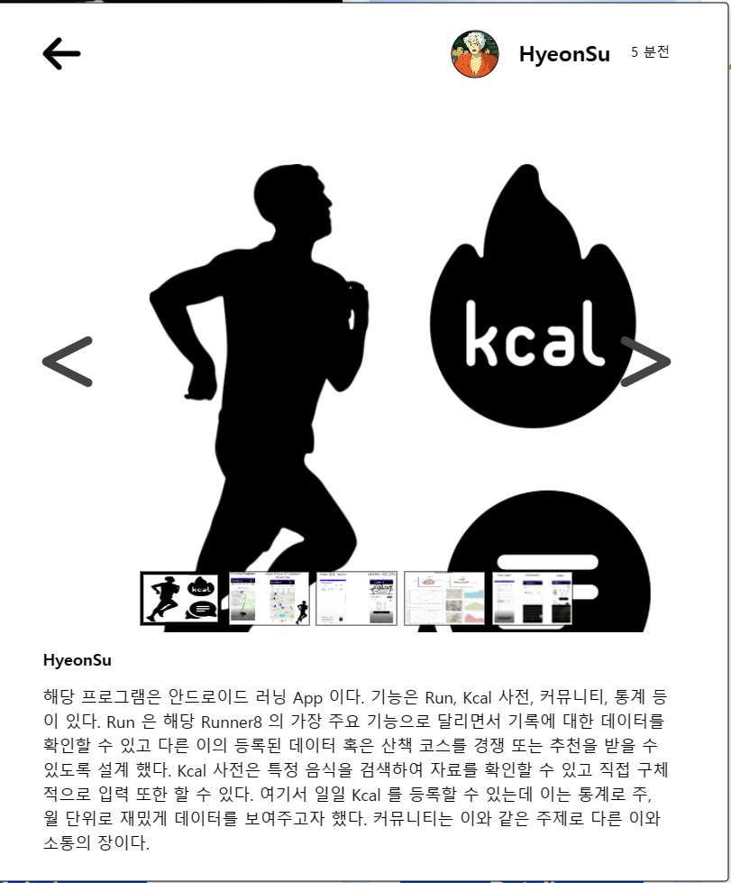

<br>
<br>


# ⚒️  `FeedModal of MyInfo Project`

<br>



<br>


* **정의**
* **기능**
* **컴포넌트**

<br>


> 정의

```
PortFolio Slider 에서
Open 버튼을 누르면 나오는 모달

해당 Feed 를 상세하게 Slider 로
페이지를 나눠서 보여주고
페이지별 썸네일 모두 보이도록 구현 
```
<br>
<br>

> 기능

<br>

&nbsp;&nbsp;`onThumbnailClick`<br>
&nbsp;&nbsp; 해당 썸네일로 페이지 이동
```javascript
  const [currentImage, setCurrentImage] = useState(0);

  const onThumbnailClick = (e) => {
    setCurrentImage(e.currentTarget.getAttribute("values"));
  };

  ...

  <ThumbnailBox>
     {ppts.map((item, idx) => {
       return (
        <Thumbnail
          key={idx}
          values={idx}
          src={item.img}
          onClick={onThumbnailClick}
          className={currentImage == idx ? "active" : ""}
        />
       );
     })}
  </ThumbnailBox>
```

<br>

&nbsp;&nbsp;`onBack & onNext`<br>
&nbsp;&nbsp; 해당 페이지 이동
```javascript
// onBack
setCurrentImage((current) => {
    current--;
    if (current < 0) {
        current = ppts.length - 1;
    }
    return current;
});

// onNext
setCurrentImage((current) => {
    current++;
    if (current == ppts.length) {
        current = 0;
    }
    return current;
});
```
<br>
<br>

> 컴포넌트

```javascript
import styled from "styled-components";
import * as Solid from "@fortawesome/free-solid-svg-icons";
import { FontAwesomeIcon } from "@fortawesome/react-fontawesome";

import { useEffect, useState } from "react";

const FeedContainer = styled.div`
  position: fixed;
  display: flex;
  flex-direction: column;
  align-items: center;

  z-index: 999;
  top: 50%;
  left: 50%;
  transform: translate(-50%, -50%);
  padding: 10px 10px 20px;

  width: 550px;
  max-height: 650px;

  margin: 0 auto;

  background-color: white;

  color: black;
  border: 1px solid ${(props) => props.theme.borderColor};
  box-shadow: rgba(0, 0, 0, 0.24) 0px 3px 8px;
  border-radius: 3px;
  &:hover {
    color: black;
  }
`;
const FeedWrapper = styled.div`
  position: relative;
`;
const FeedHeader = styled.div`
  width: 500px;
  height: 100%;
  border-radius: 3px;
  max-height: 60px;
  background-color: white;
  display: flex;
  align-items: center;
  padding: 10px 18px;
  justify-content: space-between;
  & > svg {
    cursor: pointer;
  }
`;
const Box = styled.div`
  display: flex;
  justify-content: center;
  align-items: center;
`;
const FeedHeaderRightBox = styled(Box)`
  & > div {
    cursor: pointer;
  }
  & > p {
    cursor: pointer;
  }
`;
const ProfileImg = styled.div`
  border-radius: 50%;
  border: 1px solid ${(props) => props.theme.borderColor};
  width: 35px;
  height: 35px;
  background-size: cover;
  background-position: center;
`;
const ProfileNick = styled.p`
  margin-left: 14px;
  margin: 0 auto;
  margin-left: 15px;
  transform: translateY(-5%);
  font-weight: bold;
`;
const Time = styled.span`
  font-size: 10px;
  margin-left: 15px;
  transform: translateY(-10%);
`;
const Comments = styled.p`
  width: 100%;
  padding: 18px;
  padding-top: 0px;
  padding-bottom: 5px;
  font-size: 12px;
  margin-bottom: 0px;
  text-align: start;
  display: flex;
  position: relative;
  flex-direction: column;
`;

const ImgSlider = styled.div`
  position: relative;
  width: 100%;
  height: 400px;
  overflow: hidden;
  border-radius: 5px;
`;

const ImgBox = styled.div`
  position: absolute;
  width: 530px;
  display: flex;
  justify-content: center;
`;

const Img = styled.img`
  position: absolute;
  width: 500px;
  top: 40px;
  opacity: 0;
  transform: scale(1.1);
  transition: all 500ms ease-in-out;
  padding: 0px 40px;
  &.active {
    opacity: 1;
    transform: scale(1);
  }
`;

const Contents = styled.p`
  opacity: 0;
  position: absolute;
  &.active {
    opacity: 1;
  }
`;

const SliderBtn = styled.div`
  position: absolute;
  top: 0px;
  width: 40px;
  height: 100%;
  display: flex;
  justify-content: center;
  align-items: center;
  cursor: pointer;
  color: #444;
  font-size: 25px;
  transition: all 300ms ease-in-out;
  &:hover {
    background: rgba(0, 0, 0, 0.5);
  }
`;

const ThumbnailBox = styled.div`
  position: absolute;
  bottom: 5px;
  width: 100%;
  height: 40px;
  display: flex;
  justify-content: center;
  gap: 5px;
`;

const Thumbnail = styled.img`
  width: 60px;
  height: 40px;
  cursor: pointer;
  border: 1px solid black;
  &.active {
    border: 3px solid black;
  }
`;

function FeedModal({ setModalOpen, ppts }) {
  const [currentImage, setCurrentImage] = useState(0);
  const [imagesActive, setImagesActive] = useState(new Array(10).fill("btn"));

  useEffect(() => {
    imagesActive[0] = "btn active";
    setImagesActive(imagesActive);
  }, []);

  const onThumbnailClick = (e) => {
    setCurrentImage(e.currentTarget.getAttribute("values"));
  };

  const closeModal = () => {
    setModalOpen(false);
  };
  return (
    <FeedContainer>
      <FeedWrapper>
        <FeedHeader>
          <FontAwesomeIcon
            size="2x"
            icon={Solid.faArrowLeft}
            onClick={closeModal}
          />
          <FeedHeaderRightBox>
            <ProfileImg
              style={{
                backgroundImage:
                  "url(https://cdn.eyesmag.com/content/uploads/sliderImages/2021/07/19/005-d020cb23-f09f-4f55-bfca-b2540f194ea2.jpg)",
              }}
            />
            <ProfileNick>HyeonSu</ProfileNick>
            <Time>5 분전</Time>
          </FeedHeaderRightBox>
        </FeedHeader>

        <ImgSlider>
          <ImgBox>
            {ppts.map((item, idx) => {
              return (
                
              );
            })}
          </ImgBox>
          <ThumbnailBox>
            {ppts.map((item, idx) => {
              return (
                <Thumbnail
                  key={idx}
                  values={idx}
                  src={item.img}
                  onClick={onThumbnailClick}
                  className={currentImage == idx ? "active" : ""}
                />
              );
            })}
          </ThumbnailBox>
          <SliderBtn
            class="back-btn"
            onClick={() => {
              setCurrentImage((current) => {
                current--;
                if (current < 0) {
                  current = ppts.length - 1;
                }
                return current;
              });
            }}
            style={{ left: "16px" }}
          >
            <FontAwesomeIcon size="2x" icon={Solid.faLessThan} />
          </SliderBtn>
          <SliderBtn
            class="next-btn"
            onClick={() => {
              setCurrentImage((current) => {
                current++;
                if (current == ppts.length) {
                  current = 0;
                }
                return current;
              });
            }}
            style={{ right: "16px" }}
          >
            <FontAwesomeIcon size="2x" icon={Solid.faGreaterThan} />
          </SliderBtn>
        </ImgSlider>
        <Comments>
          <b
            style={{
              fontWeight: "800",
              paddingRight: "5px",
              padding: "10px 0px",
            }}
          >
            HyeonSu{" "}
          </b>
          <div
            style={{
              position: "relative",
              height: "400px",
              marginBottom: "25px",
            }}
          >
            {ppts.map((item, idx) => {
              return (
                <Contents
                  key={idx}
                  className={currentImage == idx ? "active" : ""}
                >
                  {item.contents}
                </Contents>
              );
            })}
          </div>
        </Comments>
      </FeedWrapper>
    </FeedContainer>
  );
}

export default FeedModal;

```