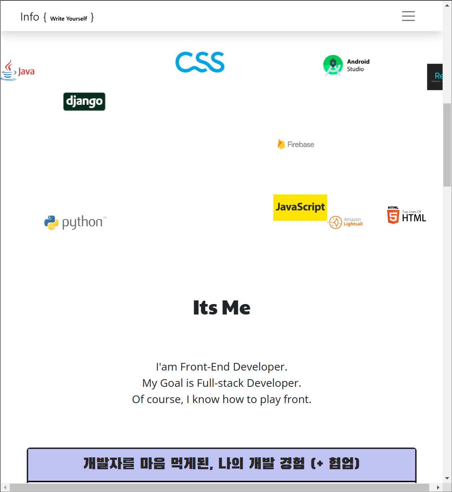

<br>
<br>


# ⚒️  `MarqueeSlider of MyInfo Project`


<br>



<br>


* **동기**
* **정의**
* **기능**
* **컴포넌트**

<br>


> 동기

```
MongoDB 의 홈 페이지 중간 부분에서
Marquee Slider 를 보고 감명받아

비슷하게 나의 기술스택을 표현하자해서 구현
```
<br>
<br>


> 정의

```
lodash 의 times 를 통해 일정한 주기별로 동작
nanoid 로 각자 다른 고유 id 를 생성
marquee 로 만든 반응형 Slider

〈marquee〉 태그 
    
    글자나 그림(이미지) 등을 상하좌우로 
    움직이는 연출을 하고 싶을 때 사용
```
<br>
<br>

> 기능

<br>

&nbsp;&nbsp;`* nanoid`
```javascript
import { nanoid } from "nanoid";

const [key, setKey] = useState(nanoid());

useEffect(() => {
   setKey(nanoid());
}, [size, size.width]);
```

<br>

&nbsp;&nbsp;`* lodash/times`<br>

&nbsp;&nbsp;&nbsp;&nbsp;주어진 횟수만큼 반복하여 콜백 함수를 호출<br>&nbsp;&nbsp;&nbsp;&nbsp;각 반복에서 반환된 결과를 배열로 모아 반환
```javascript
import times from "lodash/times";

...

{times(14, Number).map((id) => (
        ....
))}
```
<br>

&nbsp;&nbsp;`* react-marquee-slider`<br><br>
&nbsp;&nbsp;&nbsp;&nbsp;Marquee 는 여러 개의 슬라이드를 가로로 연속적으로 이동시켜 <br>&nbsp;&nbsp;&nbsp;&nbsp;사용자에게 다양한 콘텐츠를 보여줄 수 있음
<br><br>&nbsp;&nbsp;&nbsp;&nbsp;Motion 는 애니메이션 효과를 가진 요소를 렌더링
<br><br>&nbsp;&nbsp;&nbsp;&nbsp;randomIntFromInterval 는 주어진 최소값과 최대값 사이의 임의의 정수를 반환

```javascript
import Marquee, { Motion, randomIntFromInterval } from "react-marquee-slider";

...

    <FullWidth className={styles.marquee_box}>
        <Height height={450}>
          <Marquee
            key={key}
            velocity={12}
            minScale={0.7}
            resetAfterTries={200}
            scatterRandomly
            onInit={onStartPerformance}
            onFinish={onEndPerformance}
          >
            {times(14, Number).map((id) => (
              <Motion
                key={`marquee-example-company-${id}`}
                initDeg={randomIntFromInterval(0, 360)}
                direction={
                  Math.random() > 0.5 ? "clockwise" : "counterclockwise"
                }
                velocity={5}
                radius={scale * 100}
              >
                <Company scale={scale * 1.3}>
                  <Logo src={tech_icons[id]} alt="" />
                </Company>
              </Motion>
            ))}
          </Marquee>
        </Height>
     </FullWidth>
```
```
FullWidth, Height, Company, Logo 는 
StyleComponents 로 구현한 컴포넌트
```

<br>
<br>

> 컴포넌트

```javascript
import React, { useState, useEffect } from "react";
import { withSize } from "react-sizeme";
import { nanoid } from "nanoid";

import styled from "styled-components";
import times from "lodash/times";
import Marquee, { Motion, randomIntFromInterval } from "react-marquee-slider";
import tech_icons from "../tech_icons";
import styles from "./itsme.module.css";

import FullWidth from "./FullWidth";

const Height = styled.div`
  position: relative;
  width: 100%;
  height: ${(props) => (props.height ? props.height + "px" : "auto")};
`;

const Company = styled.div`
  position: relative;
  width: ${(props) => props.scale * 75}px;
  height: ${(props) => props.scale * 75}px;
`;

const Logo = styled.img`
  display: block;
  /* https://stackoverflow.com/questions/24843676/how-can-i-fit-a-square-html-image-inside-a-circle-border */
  /* just making it < 70.7% */
  width: auto;
  height: 100%;
`;

const Companies = ({ size, onStartPerformance, onEndPerformance }) => {
  const [key, setKey] = useState(nanoid());

  useEffect(() => {
    setKey(nanoid());
  }, [size, size.width]);

  let scale = 0.3;

  if (size && size.width > 800) {
    scale = 0.5;
  }

  if (size && size.width > 1100) {
    scale = 0.65;
  }

  if (size && size.width > 1400) {
    scale = 0.8;
  }

  return (
    <>
      <FullWidth className={styles.marquee_box}>
        <Height height={450}>
          <Marquee
            key={key}
            velocity={12}
            minScale={0.7}
            resetAfterTries={200}
            scatterRandomly
            onInit={onStartPerformance}
            onFinish={onEndPerformance}
          >
            {times(14, Number).map((id) => (
              <Motion
                key={`marquee-example-company-${id}`}
                initDeg={randomIntFromInterval(0, 360)}
                direction={
                  Math.random() > 0.5 ? "clockwise" : "counterclockwise"
                }
                velocity={5}
                radius={scale * 100}
              >
                <Company scale={scale * 1.3}>
                  <Logo src={tech_icons[id]} alt="" />
                </Company>
              </Motion>
            ))}
          </Marquee>
        </Height>
      </FullWidth>
    </>
  );
};

export default React.memo(withSize()(Companies));

```
```
"withSize"는 "react-sizeme" 라이브러리에서 제공되는 
고차 컴포넌트(Higher-Order Component, HOC)입니다. 
이를 사용하면 컴포넌트의 크기 정보를 쉽게 얻을 수 있습니다.

"React.memo"를 적용하여 해당 컴포넌트의 속성이 
변경되지 않는 한 렌더링 결과를 캐시하고 재사용

  -> React 16.6 버전 이후부터 React.memo는 
     React Hooks의 등장으로 인해 함수형 컴포넌트에서도 
     메모이제이션을 쉽게 적용할 수 있는 훅으로 변경
```
