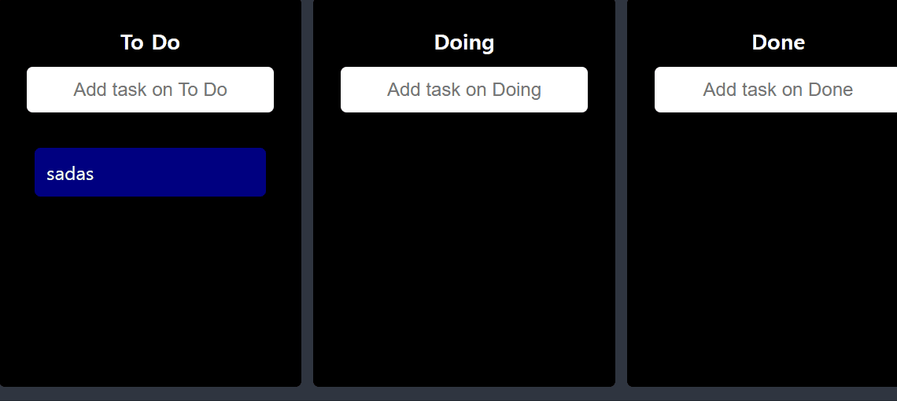

<br>
<br>


# ⚒️  `Drag & Drop of ReactMaster Project`

<br>



<br>

* **정의**
* **설치**
* **환경설정**
* **실전코드**

<br>


> 정의

```
ReactMaster 에서
To Do , Doing , Done  리스트를 각각 나눠서
해당 리스트에 Item 을 다른 리스트에 
Drag & Drop 할 수 있는 기능
```
<br>
<br>

> 설치

<br>

```javascript
npm i react-beautiful-dnd
```
<br>
<br>

> 환경설정

<br>

## &nbsp;&nbsp; `Next.config.js`<br>
&nbsp;&nbsp; &nbsp; Strict Mode 종료
```javascript
/** @type {import('next').NextConfig} */
const nextConfig = {
  reactStrictMode: false,
  compiler: {
    styledComponents: true,
  },
};
```
<br>
<br>

> 실전코드

<br>

## &nbsp;&nbsp; `atom.ts`<br>
&nbsp;&nbsp; &nbsp; DragDropContext 설정
```javascript
export interface ITodo {
  id: number;
  text: string;
}

interface IToDoState {
  [key: string]: ITodo[];
}

export const toDoState = atom<IToDoState>({
  key: "toDo",
  default: {
    "To Do": [],
    Doing: [],
    Done: [],
  },
});
```

<br>

## &nbsp;&nbsp; `index.tsx`<br>
&nbsp;&nbsp; &nbsp; DragDropContext 설정
```javascript
import { DragDropContext, DropResult } from "react-beautiful-dnd";
import { useRecoilState } from "recoil";
import { toDoState } from "../atom";

...

const [toDos, setToDos] = useRecoilState(toDoState);
const onDragEnd = (info: DropResult) => {
    const { destination, source } = info;
    // 도착지 없으면 Drag No!!
    if (!destination) return;

    // 도착지가 일치하면 순서 indexing Drag OK!!
    if (destination?.droppableId === source.droppableId) {
      // same board movement.
      setToDos((allBoards) => {
        const boardCopy = [...allBoards[source.droppableId]];
        const taskObj = boardCopy[source.index];
        boardCopy.splice(source.index, 1);
        boardCopy.splice(destination?.index, 0, taskObj);
        return {
          ...allBoards,
          [source.droppableId]: boardCopy,
        };
      });
    }

    // 도착지가 불일치하면
    // 해당 List 로 옮기고 순서 indexing Drag OK!!
    if (destination.droppableId !== source.droppableId) {
      // cross board movement
      setToDos((allBoards) => {
        const sourceBoard = [...allBoards[source.droppableId]];
        const taskObj = sourceBoard[source.index];
        const destinationBoard = [...allBoards[destination.droppableId]];
        sourceBoard.splice(source.index, 1);
        destinationBoard.splice(destination?.index, 0, taskObj);
        return {
          ...allBoards,
          [source.droppableId]: sourceBoard,
          [destination.droppableId]: destinationBoard,
        };
      });
    }
  };

  ...

  return (
    <DragDropContext onDragEnd={onDragEnd}>
      <Wrapper>
        <Boards>
          {Object.keys(toDos).map((boardId) => (
            <Board boardId={boardId} key={boardId} toDos={toDos[boardId]} />
          ))}
        </Boards>
      </Wrapper>
    </DragDropContext>
  );
```


<br>

## &nbsp;&nbsp; `board.tsx`<br>
&nbsp;&nbsp; &nbsp; Droppable 설정
```javascript
import styled from "styled-components";
import DragabbleCard from "./DragabbleCard";

import { useForm } from "react-hook-form";
import { Droppable } from "react-beautiful-dnd";
import { ITodo, toDoState } from "../atom";
import { useSetRecoilState } from "recoil";

const Wrapper = styled.div`
  width: 300px;
  padding: 20px 10px;
  padding-top: 10px;
  background-color: ${(props) => props.theme.borderColor};
  border-radius: 5px;
  min-height: 300px;
  display: flex;
  flex-direction: column;
  overflow: hidden;
`;

const Title = styled.h2`
  text-align: center;
  font-weight: 600;
  margin-bottom: 10px;
  font-size: 18px;
`;
interface IAreaProps {
  isDraggingFromThis: boolean;
  isDraggingOver: boolean;
}

const Area = styled.div<IAreaProps>`
  background-color: ${(props) =>
    props.isDraggingOver
      ? "#dfe6e9"
      : props.isDraggingFromThis
      ? "#b2bec3"
      : "transparent"};
  flex-grow: 1;
  transition: background-color 0.3s ease-in-out;
  padding: 20px;
`;
const Form = styled.form`
  width: 100%;
  display: flex;
  justify-content: center;
  padding-bottom: 10px;
  input {
    font-size: 16px;
    border: 0;
    background-color: white;
    width: 80%;
    padding: 10px;
    border-radius: 5px;
    text-align: center;
    margin: 0 auto;
  }
`;

interface IBoardProps {
  toDos: ITodo[];
  boardId: string;
}

interface IForm {
  toDo: string;
}

function Board({ toDos, boardId }: IBoardProps) {
  const setToDos = useSetRecoilState(toDoState);
  const { register, setValue, handleSubmit } = useForm<IForm>();
  const onValid = ({ toDo }: IForm) => {
    const newToDo = {
      id: Date.now(),
      text: toDo,
    };
    setToDos((allBoards) => {
      return {
        ...allBoards,
        [boardId]: [newToDo, ...allBoards[boardId]],
      };
    });
    setValue("toDo", "");
  };
  
  return (
    <Wrapper>
      <Title>{boardId}</Title>
      <Form onSubmit={handleSubmit(onValid)}>
        <input
          {...register("toDo", { required: true })}
          type="text"
          placeholder={`Add task on ${boardId}`}
        />
      </Form>
      <Droppable droppableId={boardId}>
        {(magic, info) => (
          <Area
            isDraggingOver={info.isDraggingOver}
            isDraggingFromThis={Boolean(info.draggingFromThisWith)}
            ref={magic.innerRef}
            {...magic.droppableProps}
          >
            {toDos.map((toDo, index) => (
              <DragabbleCard
                key={toDo.id}
                index={index}
                toDoId={toDo.id}
                toDoText={toDo.text}
              />
            ))}
            {magic.placeholder}
          </Area>
        )}
      </Droppable>
    </Wrapper>
  );
}
export default Board;
```


<br>

## &nbsp;&nbsp; `DraggableCard.tsx`<br>
&nbsp;&nbsp; &nbsp; Draggable 설정
```javascript
import React from "react";
import { Draggable } from "react-beautiful-dnd";
import styled from "styled-components";

const Card = styled.div<{ isDragging: boolean }>`
  border-radius: 5px;
  margin-bottom: 5px;
  padding: 10px;
  background-color: ${(props) =>
    props.isDragging ? "white" : props.theme.cardBgColor};
  box-shadow: ${(props) =>
    props.isDragging ? "0px 2px 5px rgba(0, 0, 0, 0.05)" : "none"};
`;

interface IDraggableCardProps {
  toDoId: number;
  toDoText: string;
  index: number;
}

function DraggableCard({ toDoId, toDoText, index }: IDraggableCardProps) {
  return (
    <Draggable draggableId={toDoId + ""} index={index}>
      {(magic, snapshot) => {
        return (
          <Card
            isDragging={snapshot.isDragging}
            ref={magic.innerRef}
            {...magic.dragHandleProps}
            {...magic.draggableProps}
          >
            {toDoText}
          </Card>
        );
      }}
    </Draggable>
  );
}

export default React.memo(DraggableCard);
```

```
📢

React.memo는 컴포넌트의 props가 변경되었을 때만 
리렌더링을 수행하도록 동작

이전에 렌더링된 결과를 메모이제이션하고, 
이후에 동일한 props로 다시 렌더링되었을 때는 
이전에 메모이제이션된 결과를 재사용하여 
불필요한 리렌더링을 방지
```