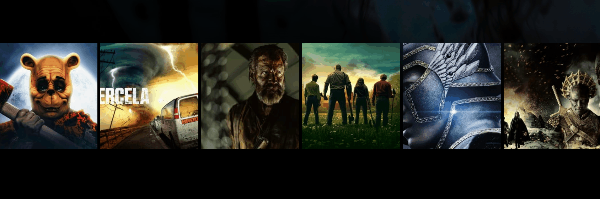

<br>
<br>


# ⚒️  `FramerMotion Home of ReactMaster Project`

<br>


* **정의**
* **motion 컴포넌트**
* **코드**

<br>


> 정의

```
React 애니메이션 라이브러리

사용자 인터페이스의 움직임과 
애니메이션을 만들기 위한 풍부한 기능과 
API를 제공

다양한 애니메이션 효과, 
상호작용 및 모션 컨트롤 기능을 사용

웹 애플리케이션에서 매끄럽고 멋진 애니메이션을 구현
```
<br>
<br>

> motion 컴포넌트

<br>

## &nbsp;&nbsp; `오버레이 & Big Movie`

<br>


<br>


```javascript
import { motion, AnimatePresence, useViewportScroll } from "framer-motion";


const BigMovie = styled(motion.div)`
  position: absolute;
  width: 40vw;
  height: 80vh;
  left: 0;
  right: 0;
  margin: 0 auto;
  border-radius: 15px;
  overflow: hidden;
  background-color: ${(props) => props.theme.black.lighter};
`;

const BigCover = styled.div`
  width: 100%;
  background-size: cover;
  background-position: center center;
  height: 400px;
`;

const BigTitle = styled.h3`
  color: ${(props) => props.theme.white.lighter};
  padding: 20px;
  font-size: 46px;
  position: relative;
  top: -80px;
`;

const BigOverview = styled.p`
  padding: 20px;
  position: relative;
  top: -80px;
  color: ${(props) => props.theme.white.lighter};
`;

const Overlay = styled(motion.div)`
  position: fixed;
  top: 0;
  width: 100%;
  height: 100%;
  background-color: rgba(0, 0, 0, 0.5);
  opacity: 0;
`;

...

 const bigMovieMatch = useMatch("/movies/:movieId");

  const { movieId } = useParams<{ movieId: string | undefined }>();
  const { scrollY } = useViewportScroll();
  const clickedMovie =
    bigMovieMatch?.params.movieId &&
    data?.results.find((movie) => movie.id === +movieId!)!;
  
  
const onOverlayClick = () => navigate(`/`);
...

<AnimatePresence>
    {bigMovieMatch ? (
        <>
        <Overlay
            onClick={onOverlayClick}
            exit={{ opacity: 0 }}
            animate={{ opacity: 1 }}
        />
        <BigMovie
            style={{ top: scrollY.get() + 100 }}
            layoutId={bigMovieMatch.params.movieId}
        >
            {clickedMovie && (
            <>
                <BigCover
                style={{
                    backgroundImage: `linear-gradient(to top, black, transparent), url(${makeImagePath(
                    clickedMovie.backdrop_path,
                    "w500"
                    )})`,
                }}
                />
                <BigTitle>{clickedMovie.title}</BigTitle>
                <BigOverview>{clickedMovie.overview}</BigOverview>
            </>
            )}
        </BigMovie>
        </>
    ) : null}
</AnimatePresence>
```
<br>

## &nbsp;&nbsp; `Row`

<br>


<br>

## &nbsp;&nbsp; `Box & Info`

<br>



<br>

```javascript
import { motion, useAnimation, useViewportScroll } from "framer-motion";

const Row = styled(motion.div)`
  display: grid;
  gap: 5px;
  grid-template-columns: repeat(6, 1fr);
  position: absolute;
  width: 100%;
`;

const Box = styled(motion.div)<{ bgPhoto: string }>`
  background-color: white;
  background-image: url(${(props) => props.bgPhoto});
  background-size: cover;
  background-position: center center;
  height: 200px;
  font-size: 66px;
  cursor: pointer;
  &:first-child {
    transform-origin: center left;
  }
  &:last-child {
    transform-origin: center right;
  }
`;

const Info = styled(motion.div)`
  padding: 10px;
  background-color: ${(props) => props.theme.black.lighter};
  opacity: 0;
  position: absolute;
  width: 100%;
  bottom: 0;
  h4 {
    text-align: center;
    font-size: 18px;
  }
`;

const rowVariants = {
  hidden: {
    x: window.outerWidth + 5,
  },
  visible: {
    x: 0,
  },
  exit: {
    x: -window.outerWidth - 5,
  },
};

const boxVariants = {
  normal: {
    scale: 1,
  },
  hover: {
    scale: 1.3,
    y: -80,
    transition: {
      delay: 0.5,
      duaration: 0.1,
      type: "tween",
    },
  },
};

const infoVariants = {
  hover: {
    opacity: 1,
    transition: {
      delay: 0.5,
      duaration: 0.1,
      type: "tween",
    },
  },
};

const offset = 6;

...
  const { data, isLoading } = useQuery<IGetMoviesResult>(
    ["movies", "nowPlaying"],
    getMovies
  );
  const [index, setIndex] = useState(0);
  const [leaving, setLeaving] = useState(false);

  const incraseIndex = () => {
    if (data) {
      if (leaving) return;
      toggleLeaving();
      const totalMovies = data.results.length - 1;
      const maxIndex = Math.floor(totalMovies / offset) - 1;
      setIndex((prev) => (prev === maxIndex ? 0 : prev + 1));
    }
  };

  const toggleLeaving = () => setLeaving((prev) => !prev);
  
...
   <Banner
    onClick={incraseIndex}
    bgPhoto={makeImagePath(data?.results[0].backdrop_path || "")}
    >
      <Title>{data?.results[0].title}</Title>
      <Overview>{data?.results[0].overview}</Overview>
    </Banner>
    <Slider>
      <AnimatePresence initial={false} onExitComplete={toggleLeaving}>
        <Row
        variants={rowVariants}
        initial="hidden"
        animate="visible"
        exit="exit"
        transition={{ type: "tween", duration: 1 }}
        key={index}
        >
        {data?.results
            .slice(1)
            .slice(offset * index, offset * index + offset)
            .map((movie) => (
            <Box
                layoutId={movie.id + ""}
                key={movie.id}
                whileHover="hover"
                initial="normal"
                variants={boxVariants}
                onClick={() => onBoxClicked(movie.id)}
                transition={{ type: "tween" }}
                bgPhoto={makeImagePath(movie.backdrop_path, "w500")}
            >
                <Info variants={infoVariants}>
                <h4>{movie.title}</h4>
                </Info>
            </Box>
            ))}
        </Row>
      </AnimatePresence>
    </Slider>
```
<br>
<br>


> 코드

<br>

## &nbsp;&nbsp; `전체코드`
```javascript
import { useQuery } from "react-query";
import styled from "styled-components";
import { getMovies, IGetMoviesResult } from "../api";
import { makeImagePath } from "../utils";
import { useState } from "react";
import { useNavigate, useMatch, useParams } from "react-router-dom";
import { motion, AnimatePresence, useViewportScroll } from "framer-motion";

const Wrapper = styled.div`
  background: black;
  padding-bottom: 200px;
`;

const Loader = styled.div`
  height: 20vh;
  display: flex;
  justify-content: center;
  align-items: center;
`;
const Overlay = styled(motion.div)`
  position: fixed;
  top: 0;
  width: 100%;
  height: 100%;
  background-color: rgba(0, 0, 0, 0.5);
  opacity: 0;
`;

const BigMovie = styled(motion.div)`
  position: absolute;
  width: 40vw;
  height: 80vh;
  left: 0;
  right: 0;
  margin: 0 auto;
  border-radius: 15px;
  overflow: hidden;
  background-color: ${(props) => props.theme.black.lighter};
`;

const BigCover = styled.div`
  width: 100%;
  background-size: cover;
  background-position: center center;
  height: 400px;
`;

const BigTitle = styled.h3`
  color: ${(props) => props.theme.white.lighter};
  padding: 20px;
  font-size: 46px;
  position: relative;
  top: -80px;
`;

const BigOverview = styled.p`
  padding: 20px;
  position: relative;
  top: -80px;
  color: ${(props) => props.theme.white.lighter};
`;
const Banner = styled.div<{ bgPhoto: string }>`
  height: 100vh;
  display: flex;
  flex-direction: column;
  justify-content: center;
  padding: 60px;
  background-image: linear-gradient(rgba(0, 0, 0, 0), rgba(0, 0, 0, 1)),
    url(${(props) => props.bgPhoto});
  background-size: cover;
`;

const Title = styled.h2`
  font-size: 68px;
  margin-bottom: 20px;
`;

const Overview = styled.p`
  font-size: 30px;
  width: 50%;
`;

const Slider = styled.div`
  position: relative;
  top: -100px;
`;

const Row = styled(motion.div)`
  display: grid;
  gap: 5px;
  grid-template-columns: repeat(6, 1fr);
  position: absolute;
  width: 100%;
`;

const Box = styled(motion.div)<{ bgPhoto: string }>`
  background-color: white;
  background-image: url(${(props) => props.bgPhoto});
  background-size: cover;
  background-position: center center;
  height: 200px;
  font-size: 66px;
  cursor: pointer;
  &:first-child {
    transform-origin: center left;
  }
  &:last-child {
    transform-origin: center right;
  }
`;
const Info = styled(motion.div)`
  padding: 10px;
  background-color: ${(props) => props.theme.black.lighter};
  opacity: 0;
  position: absolute;
  width: 100%;
  bottom: 0;
  h4 {
    text-align: center;
    font-size: 18px;
  }
`;
const rowVariants = {
  hidden: {
    x: window.outerWidth + 5,
  },
  visible: {
    x: 0,
  },
  exit: {
    x: -window.outerWidth - 5,
  },
};

const boxVariants = {
  normal: {
    scale: 1,
  },
  hover: {
    scale: 1.3,
    y: -80,
    transition: {
      delay: 0.5,
      duaration: 0.1,
      type: "tween",
    },
  },
};
const infoVariants = {
  hover: {
    opacity: 1,
    transition: {
      delay: 0.5,
      duaration: 0.1,
      type: "tween",
    },
  },
};
const offset = 6;

function Home() {
  const navigate = useNavigate();
  const bigMovieMatch = useMatch("/movies/:movieId");

  const { movieId } = useParams<{ movieId: string | undefined }>();
  const { scrollY } = useViewportScroll();
  const { data, isLoading } = useQuery<IGetMoviesResult>(
    ["movies", "nowPlaying"],
    getMovies
  );
  const [index, setIndex] = useState(0);
  const [leaving, setLeaving] = useState(false);

  const incraseIndex = () => {
    if (data) {
      if (leaving) return;
      toggleLeaving();
      const totalMovies = data.results.length - 1;
      const maxIndex = Math.floor(totalMovies / offset) - 1;
      setIndex((prev) => (prev === maxIndex ? 0 : prev + 1));
    }
  };

  const toggleLeaving = () => setLeaving((prev) => !prev);

  const onBoxClicked = (movieId: number) => {
    navigate(`/movies/${movieId}`);
  };
  const onOverlayClick = () => navigate(`/`);

  const clickedMovie =
    bigMovieMatch?.params.movieId &&
    data?.results.find((movie) => movie.id === +movieId!)!;

  return (
    <Wrapper>
      {isLoading ? (
        <Loader>Loading...</Loader>
      ) : (
        <>
          <Banner
            onClick={incraseIndex}
            bgPhoto={makeImagePath(data?.results[0].backdrop_path || "")}
          >
            <Title>{data?.results[0].title}</Title>
            <Overview>{data?.results[0].overview}</Overview>
          </Banner>
          <Slider>
            <AnimatePresence initial={false} onExitComplete={toggleLeaving}>
              <Row
                variants={rowVariants}
                initial="hidden"
                animate="visible"
                exit="exit"
                transition={{ type: "tween", duration: 1 }}
                key={index}
              >
                {data?.results
                  .slice(1)
                  .slice(offset * index, offset * index + offset)
                  .map((movie) => (
                    <Box
                      layoutId={movie.id + ""}
                      key={movie.id}
                      whileHover="hover"
                      initial="normal"
                      variants={boxVariants}
                      onClick={() => onBoxClicked(movie.id)}
                      transition={{ type: "tween" }}
                      bgPhoto={makeImagePath(movie.backdrop_path, "w500")}
                    >
                      <Info variants={infoVariants}>
                        <h4>{movie.title}</h4>
                      </Info>
                    </Box>
                  ))}
              </Row>
            </AnimatePresence>
          </Slider>
          <AnimatePresence>
            {bigMovieMatch ? (
              <>
                <Overlay
                  onClick={onOverlayClick}
                  exit={{ opacity: 0 }}
                  animate={{ opacity: 1 }}
                />
                <BigMovie
                  style={{ top: scrollY.get() + 100 }}
                  layoutId={bigMovieMatch.params.movieId}
                >
                  {clickedMovie && (
                    <>
                      <BigCover
                        style={{
                          backgroundImage: `linear-gradient(to top, black, transparent), url(${makeImagePath(
                            clickedMovie.backdrop_path,
                            "w500"
                          )})`,
                        }}
                      />
                      <BigTitle>{clickedMovie.title}</BigTitle>
                      <BigOverview>{clickedMovie.overview}</BigOverview>
                    </>
                  )}
                </BigMovie>
              </>
            ) : null}
          </AnimatePresence>
        </>
      )}
    </Wrapper>
  );
}
export default Home;
```
<br>