 
 

# ⭐ Front Training

 

## &nbsp; 🧱 목차
- [📰 React 웹 프로젝트](#-react-웹-프로젝트)
  - [🧨 My Info](#-my-info)
  - [🧨 Bangsam](#-bangsam)
  - [🧨 React Master](#-react-master)
  - [🧨 Coding Garden](#-coding-garden)
  
   

- [👀 Study 기록](#-스터디-기록)
    - [🦴 Github](#-github)
    - [🦴 TypeScript](#-typescript)
    - [🦴 ES6](#-es6)
    - [🦴 W3C 웹 표준](#-w3c-웹-표준)
    - [🦴 Next.js](#-next-js)
    - [🦴 Test](#-test)
    - [🦴 Monitoring](#-monitoring)

 

- [🔗 Coding Test](#-coding-test)

 
 
 

# 📰 React 웹 프로젝트

 

## 🧨 My Info

> Discord Bot 을 활용한 `나의 웹 개발자 소개 페이지`

 

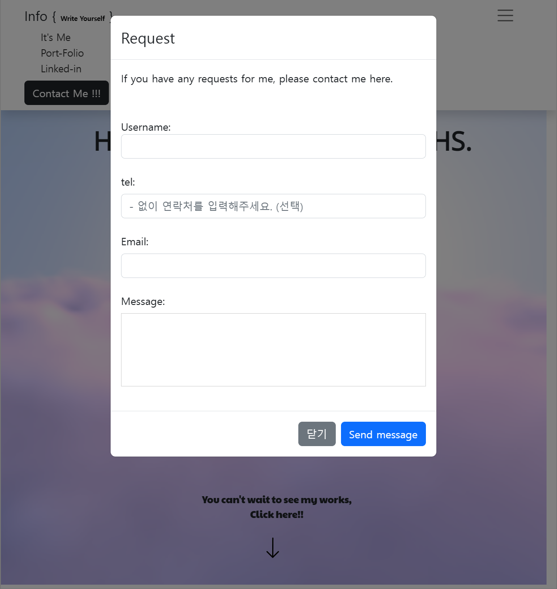

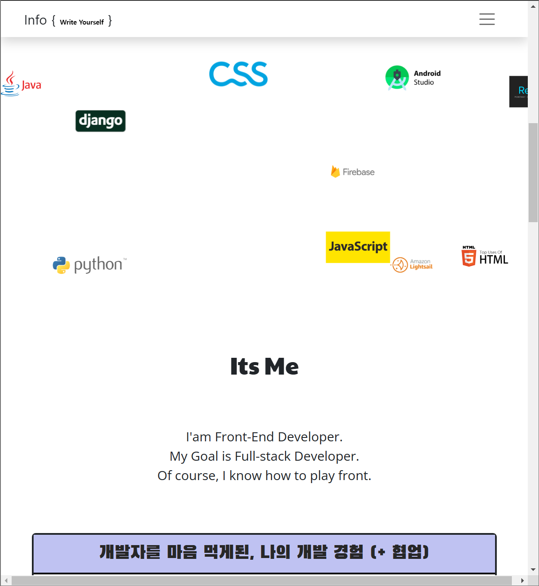

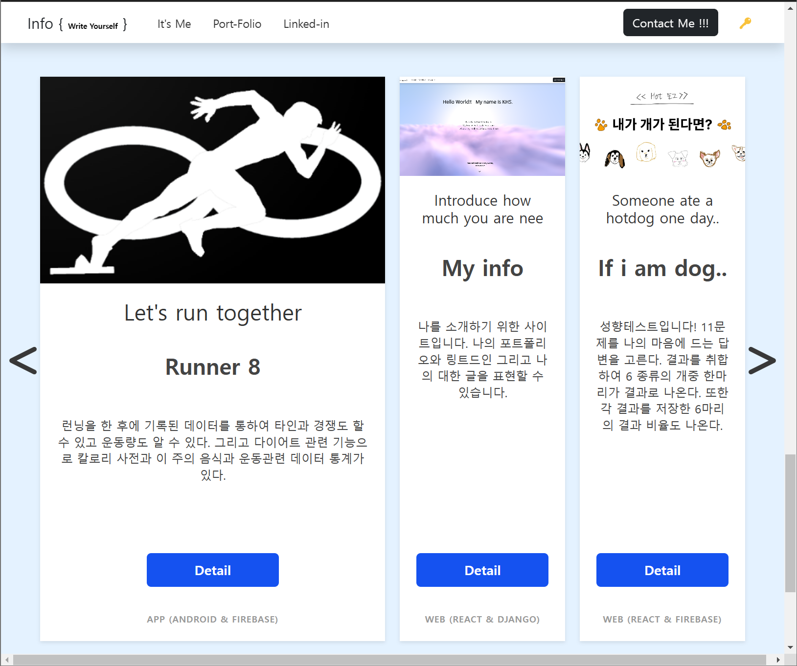

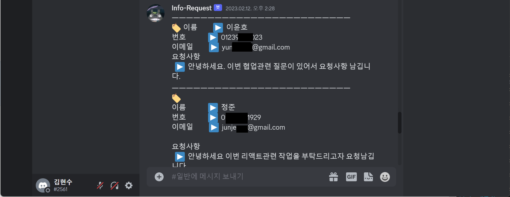

 

### **`⚙️ 개발환경`** 
- Python3.9
- Django4.0
- sqlite3
- Poetry
- Discord

 

- HTML, CSS, JavaScript
- React18.2
- Axios1.2.2
- Bootstrap5.2.3
- Style-Components5.3.6

 

### [**👣 기능 정리 링크**][myInfoLink] 

 
 

## 🧨 Bangsam

> 무한 스크롤을 구현하고 많은 필터링이 있어  상태관리가 많이 어려웠던 `부동산 채팅 웹 페이지`

 

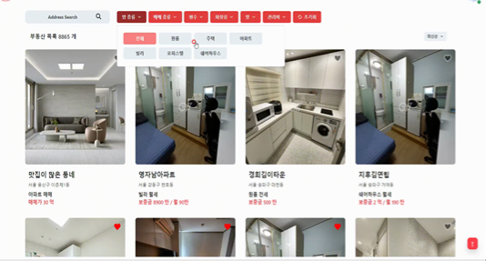

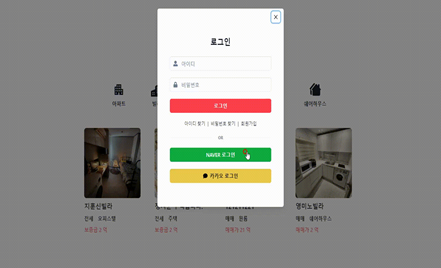

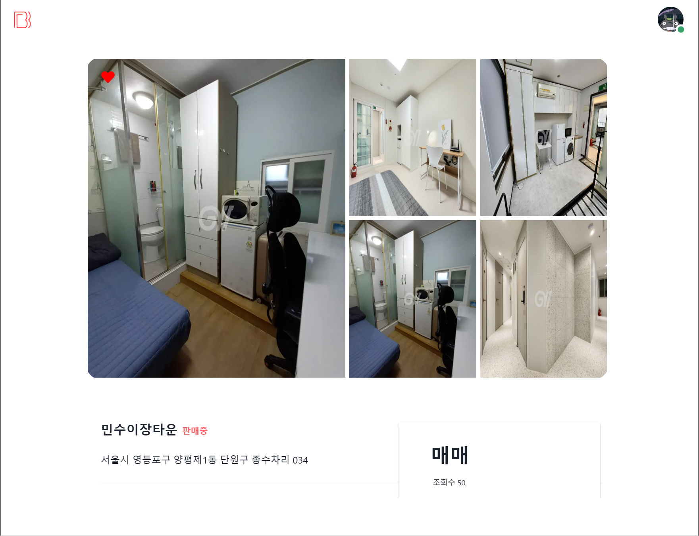

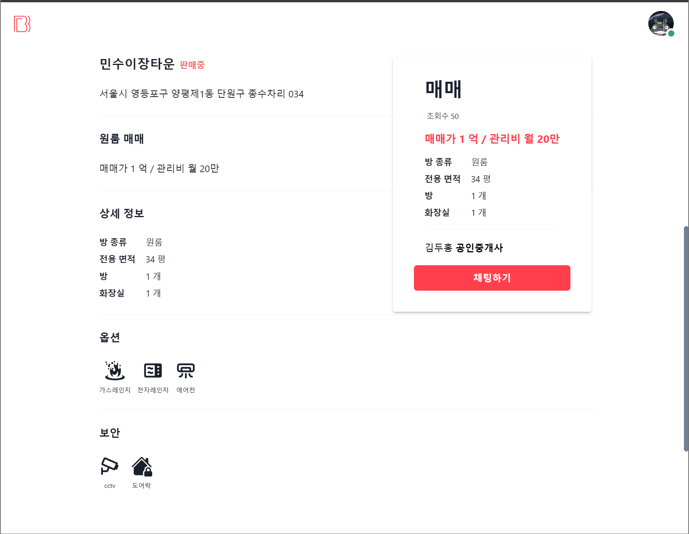
 
 

### **`⚙️ 개발환경`** 
- Python3.9
- Django4.0
- sqlite3
- Poetry
- PostgreSQL
- Uvicorn
- Gunicorn

 

- HTML, CSS, JavaScript
- React18.2
- Axios1.2.2
- react-hook-form7.43.2
- react-query3.39.3
- Style-Components5.3.6
- Chakra UI

 

### [**👣 기능 정리 링크**][bangsamLink] 

 
 

## 🧨 React Master

> TypeScript 노마드 강의를 Next.js 와 SSR 를 적용한 클론 코딩  `암호화폐 시세 트래커 / 트렐로 클론 / 모션 프로젝트`

 

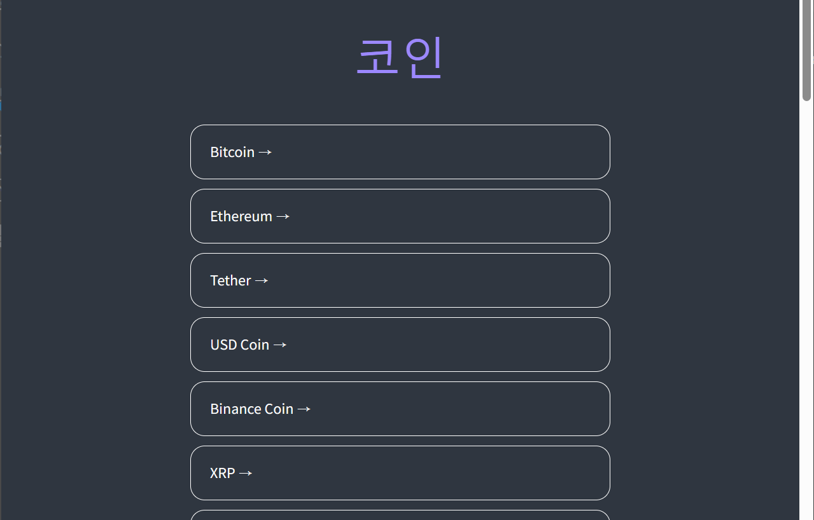

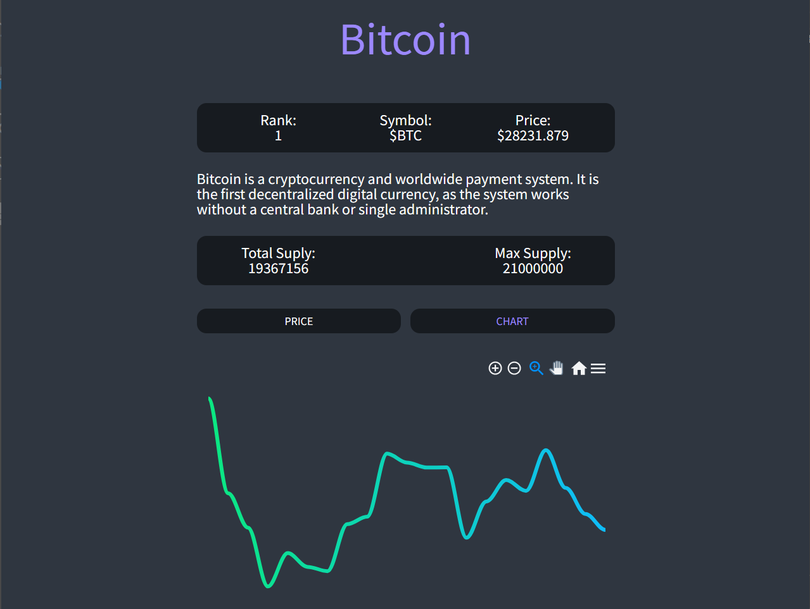

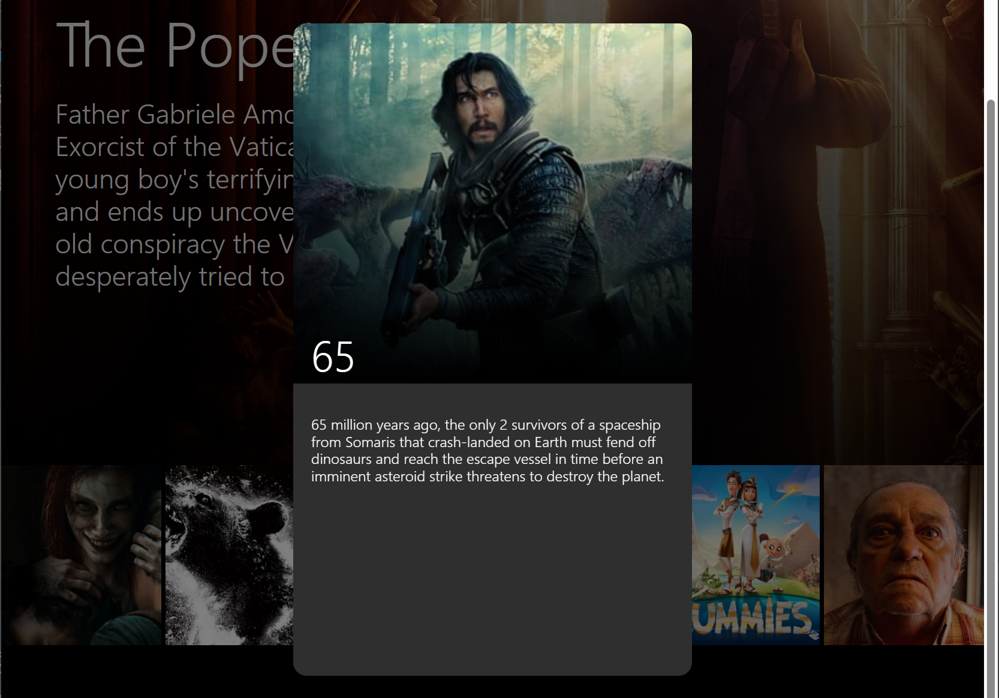
 
 

### **`⚙️ 개발환경`** 

- HTML, CSS, JavaScript
- React18.2
- Next.js
- TypeScript
- Craco6.4.0

 

- Axios1.2.2
- react-hook-form7.43.2
- react-query3.39.3
- Style-Components5.3.6
- Chakra UI

 

### [**👣 기능 정리 링크**][rmLink] 

 
 

## 🧨 Coding Garden

> TypeScript 와 Jest & RTL 을 통한 테스트 코드 작성 Recoil 을 통한 상태관리를 하는 `사용자별 대시보드에 중점을 둔 강의사이트`

 

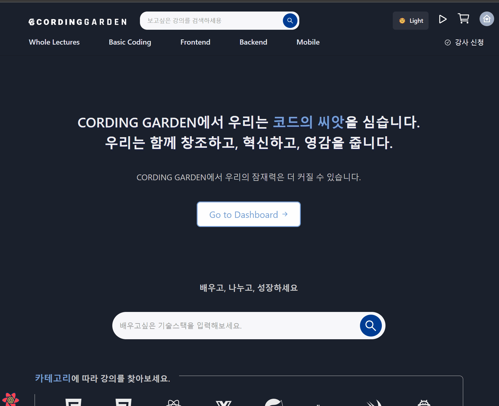

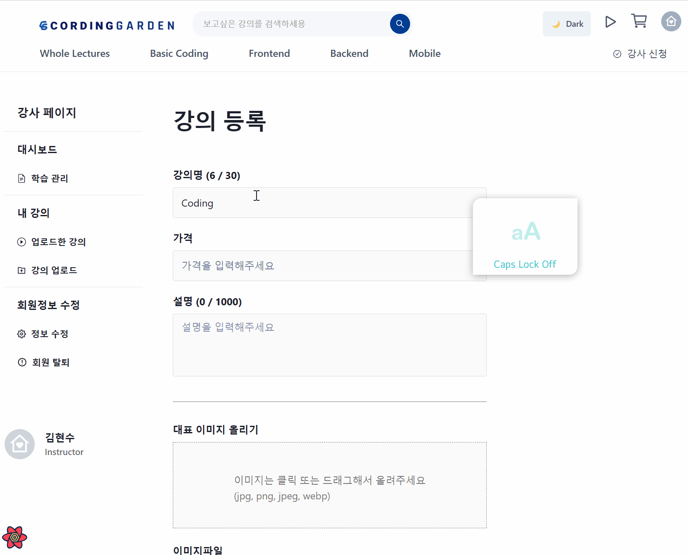

 
 

### **`⚙️ 개발환경`** 

- HTML, CSS, JavaScript
- React18.2
- TypeScript
- Jest29.5 
- RTL
- Recoil

 

- Axios1.2.2
- react-hook-form7.43.2
- react-query3.39.3
- SASS1.61
- Chakra UI
- nivo0.80
- highcharts10.3.3

 

- Sentry
- Discord

 

### [**👣 기능 정리 링크**][cgLink] 

 
 

## 👀 스터디 기록

 
 

&nbsp;&nbsp;&nbsp;&nbsp;`예시`

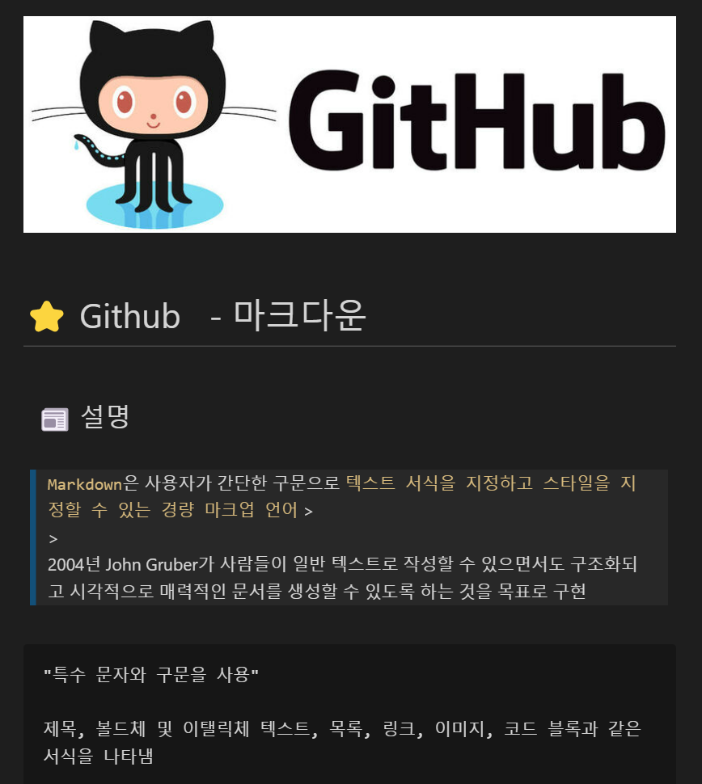

 
 

 

####  🦴 Github

- [MarkDown][gitMdLink]
    - [문법][gitMdSyntaxLink]

 
 

####  🦴 TypeScript

- [TypeScript][tsLink]
- [환경설정][tsEnvLink]

 
    
- Feat
    - [Interface][tsInterfaceLink]

 
 

####  🦴 ES6

- [ES6][esLink]
- [화살표함수][esArrowLink]
- [클래스][esClassLink]
- [매개변수-기본값][esDefaultParmasLink]
- [디스트럭처링][esDestructuringLink]
- [let-const][esLetConstLink]
- [모듈-Module][esModuleLink]
- [약속-Promises][esPromisesLink]
- [Spread-Opts][esSpreadLink]
- [Template-Literal][esLiteralLink]

 
 

####  🦴 W3C 웹 표준

- [W3C][w3cLink]
- [웹 표준화][webStandardLink]
- [HTML5][htmlLink]
- [CSS3][cssLink]

 
 

####  🦴 Next js

- [Next.js][nextLink]

 
 

####  🦴 Test

- [Test][testLink]
    - [TDD][sentryLink]    

 

- [Jest][sentryLink]
    - [환경설정][sentryEnvLink]

 
 

####  🦴 Monitoring

- [모니터링][sentryLink]

 

- [Sentry][sentryLink]
    - [환경설정][sentryEnvLink]
 
 
 

## 🔗 Coding Test

<!-- - [백준][sentryLink] -->

 

<!-- - [프로그래머스][sentryLink] -->

[cgLink]: https://github.com/JaeUpSu/My-Front-Log/blob/main/Projects/CodingGarden/ReadMe.md "Go Coding Garden" 

[rmLink]: https://github.com/JaeUpSu/My-Front-Log/blob/main/Projects/ReactMaster/ReadMe.md "Go React Master" 

[bangsamLink]: https://github.com/JaeUpSu/My-Front-Log/blob/main/Projects/Bangsam/ReadMe.md "Go Bangsam" 

[myInfoLink]: https://github.com/JaeUpSu/My-Front-Log/blob/main/Projects/MyInfo/ReadMe.md "Go MyInfo" 

[testLink]: https://github.com/JaeUpSu/My-Front-Log/blob/main/Test/%ED%85%8C%EC%8A%A4%ED%8A%B8%EC%BD%94%EB%93%9C.md "Go Test" 

[nextLink]: https://github.com/JaeUpSu/My-Front-Log/blob/main/Next.js/Next.md "Go Next" 

[gitMdLink]: https://github.com/JaeUpSu/My-Front-Log/blob/main/%F0%9F%91%80%20Github/MarkDown.md "Go Git MarkDown 문법" 

[gitMdSyntaxLink]: https://github.com/JaeUpSu/My-Front-Log/blob/main/%F0%9F%91%80%20Github/Syntax.md "Go Git MarkDown 문법" 

[tsLink]: https://github.com/JaeUpSu/My-Front-Log/blob/main/TypeScript/TypeScript.md "Go TypeScript" 

[tsEnvLink]: https://github.com/JaeUpSu/My-Front-Log/blob/main/TypeScript/%ED%99%98%EA%B2%BD%EC%84%A4%EC%A0%95.md "Go TypeScript 환경설정" 

[sentryLink]: https://github.com/JaeUpSu/My-Front-Log/blob/main/TypeScript/TypeScript.md "Go Sentry" 

[sentryEnvLink]: https://github.com/JaeUpSu/My-Front-Log/blob/main/TypeScript/%ED%99%98%EA%B2%BD%EC%84%A4%EC%A0%95.md "Go Sentry 환경설정" 

[tsInterfaceLink]: https://github.com/JaeUpSu/My-Front-Log/blob/main/TypeScript/Interface.md "Go TS Interface" 

[esLink]: https://github.com/JaeUpSu/My-Front-Log/blob/main/ES6/ES6.md "Go ES6" 

[esArrowLink]: https://github.com/JaeUpSu/My-Front-Log/blob/main/ES6/arrow-function.md "Go ES6 Arrow" 

[esClassLink]: https://github.com/JaeUpSu/My-Front-Log/blob/main/ES6/class.md "Go ES6 Class" 

[esDefaultParmasLink]: https://github.com/JaeUpSu/My-Front-Log/blob/main/ES6/default-parameters.md "Go ES6 Default Parameters" 

[esDestructuringLink]: https://github.com/JaeUpSu/My-Front-Log/blob/main/ES6/destructuring.md "Go ES6 Destructuring" 

[esLetConstLink]: https://github.com/JaeUpSu/My-Front-Log/blob/main/ES6/let-const.md "Go ES6 let & const" 

[esModuleLink]: https://github.com/JaeUpSu/My-Front-Log/blob/main/ES6/module.md "Go ES6 Module" 

[esPromisesLink]: https://github.com/JaeUpSu/My-Front-Log/blob/main/ES6/promises.md "Go ES6 Default Promises" 

[esSpreadLink]: https://github.com/JaeUpSu/My-Front-Log/blob/main/ES6/spread-operator.md "Go ES6 Spread Opts" 

[esLiteralLink]: https://github.com/JaeUpSu/My-Front-Log/blob/main/ES6/template-literals.md "Go ES6 Template Literal" 

[w3cLink]: https://github.com/JaeUpSu/My-Front-Log/blob/main/W3C%20%EC%9B%B9%20%ED%91%9C%EC%A4%80%ED%99%94/W3C.md "Go W3C" 

[webStandardLink]: https://github.com/JaeUpSu/My-Front-Log/blob/main/W3C%20%EC%9B%B9%20%ED%91%9C%EC%A4%80%ED%99%94/%EC%9B%B9%ED%91%9C%EC%A4%80.md "Go 웹 표준" 

[htmlLink]: https://github.com/JaeUpSu/My-Front-Log/blob/main/W3C%20%EC%9B%B9%20%ED%91%9C%EC%A4%80%ED%99%94/HTML5.md "Go 웹 표준 HTML5" 

[cssLink]: https://github.com/JaeUpSu/My-Front-Log/blob/main/W3C%20%EC%9B%B9%20%ED%91%9C%EC%A4%80%ED%99%94/CSS3.md "Go 웹 표준 CSS3" 
