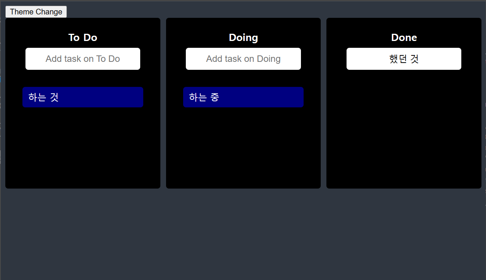

 
 

# ⭐ Front Training

 

## &nbsp; 🧱 목차
   

- ## 🗣️ 나의 발표 영상
  - [📹 React 라이프사이클 발표](#-react-라이프사이클-발표)
  
   
   

- ## 📰 React 웹 프로젝트
  - [🧨 My Info](#-my-info)
  - [🧨 Bangsam](#-bangsam)
  - [🧨 React Master](#-react-master)
  - [🧨 Coding Garden](#-coding-garden)
  
   
   

- ## 👀 Study 기록
    - [🦴 Github](#-github)
    - [🦴 JavaScript](#-javascript)
    - [🦴 TypeScript](#-typescript)
    - [🦴 ES6](#-es6)
    - [🦴 W3C 웹 표준](#-w3c-웹-표준)
    - [🦴 상태관리](#-상태관리)
    - [🦴 Next.js](#-next-js)
    - [🦴 Test](#-test)
    - [🦴 Monitoring](#-monitoring)
    - [🦴 DDD](#-ddd)
    - [🦴 AS A Service](#-as-a-service)

 
 

- ## 🔗 Coding Test
    - [🔩 Hacker Rank](#-coding-test)

 
 
 

# 🗣️ 나의 발표 영상

## `📹 React 라이프사이클 발표`

 

> React 라이프사이클 에 대해 발표 
Class 를 사용한 컴포넌트때 라이프사이클 네이밍 ë¶„ì„  
직접적으로 라이프사이클에 영향을 주는  
useState 와 useEffect 분석

 

## ⬇️ Click !!!

 

 
 
 

# 📰 React 웹 프로젝트

 

## 🧨 My Info

> Discord Bot 을 활용한 `나의 웹 개발자 소개 페이지`

 

 

### **`⚙️ 개발환경`** 
- Python3.9
- Django4.0
- sqlite3
- Poetry
- Discord

 

- HTML, CSS, JavaScript
- React18.2
- Axios1.2.2
- Bootstrap5.2.3
- Style-Components5.3.6

 

### [**👣 기능 정리 링크**][myInfoLink] 

 
 

## 🧨 Bangsam

> 무한 스크롤을 구현하고 많은 필터링이 있어  상태관리가 많이 어려웠던 `부동산 채팅 웹 페이지`

 

 
 

### **`⚙️ 개발환경`** 
- Python3.9
- Django4.0
- sqlite3
- Poetry
- PostgreSQL
- Uvicorn
- Gunicorn

 

- HTML, CSS, JavaScript
- React18.2
- Axios1.2.2
- react-hook-form7.43.2
- react-query3.39.3
- Style-Components5.3.6
- Chakra UI

 

### [**👣 기능 정리 링크**][bangsamLink] 

 
 

## 🧨 React Master

> TypeScript 노마드 강의를 Next.js 와 SSR 를 적용한 클론 코딩  `암호화폐 시세 트래커 / 트렐로 클론 / 모션 프로젝트`

 

 
 

### **`⚙️ 개발환경`** 

- HTML, CSS, JavaScript
- React18.2
- Next.js
- TypeScript
- Craco6.4.0

 

- Axios1.2.2
- react-hook-form7.43.2
- react-query3.39.3
- Style-Components5.3.6
- Chakra UI

 

### [**👣 기능 정리 링크**][rmLink] 

 
 

## 🧨 Coding Garden

> TypeScript 와 Jest & RTL 을 통한 테스트 코드 작성 Recoil 을 통한 상태관리를 하는 `사용자별 대시보드에 중점을 둔 강의사이트`

 

**`* 해당 프로젝트는 Next.js 와 E2E Test Code 그리고 D3 를 이용한 완전 Custom 한 Chart 를 추가하여 Update 할 예정`**

 
 

 
 

### **`⚙️ 개발환경`** 

- HTML, CSS, JavaScript
- React18.2
- TypeScript
- Jest29.5 
- RTL
- Recoil

 

- Axios1.2.2
- react-hook-form7.43.2
- react-query3.39.3
- SASS1.61
- Chakra UI
- nivo0.80
- highcharts10.3.3

 

- Sentry
- Discord

 

### [**👣 기능 정리 링크**][cgLink] 

 
 

## 👀 스터디 기록

 
 

&nbsp;&nbsp;&nbsp;&nbsp;`예시`

 
 

 

####  🦴 Github

- [MarkDown][gitMdLink]
    - [문법][gitMdSyntaxLink]

 

 

####  🦴 JavaScript

- [Math 의 내장 기능들][jsMathLink]
- [Number 의 내장 기능들][jsNumberLink]
- [배열의 내장 기능들][jsArrLink]
- [문자열의 내장 기능들][jsStringLink]
- [스프레드 활용][jsSpreadLink]

 

####  🦴 TypeScript

- [TypeScript][tsLink]
- [환경설정][tsEnvLink]

 
    
- Feat
    - [Interface][tsInterfaceLink]
    - [Generic][tsGenericLink]

 
 

####  🦴 ES6

- [ES6][esLink]
- [화살표함수][esArrowLink]
- [클래스][esClassLink]
- [매개변수-기본값][esDefaultParmasLink]
- [디스트럭처링][esDestructuringLink]
- [let-const][esLetConstLink]
- [모듈-Module][esModuleLink]
- [약속-Promises][esPromisesLink]
- [Spread-Opts][esSpreadLink]
- [Template-Literal][esLiteralLink]

 
 

####  🦴 W3C 웹 표준

- [W3C][w3cLink]
- [웹 표준화][webStandardLink]
- [HTML5][htmlLink]
- [CSS3][cssLink]

 
 

####  🦴 상태관리

- [상태관리][stateManageLink]
- [Recoil][smRecoilLink]
- [Context][smContextLink]

 
 

####  🦴 Next js

- [Next.js][nextLink]
- [내장기능][nextInLink]
- [_document][nextDocumentLink]
- [_app][nextAppLink]
- [SSR][nextSSRLink]
- [SSG][nextSSGLink]
- [라우팅][nextRoutingLink]
- [dehydrate][nextDehydrateLink]
- [styled-components][nextStyledComponentsLink]
- [className][nextClassNameLink]
- [NextScript][nextScriptLink]
- [NextPage][nextPageLink]
- [ErrorPage][nextErrorPageLink]

 
 

####  🦴 Test

- [Test][testLink]
- [TDD][testTddLink]
- [단위테스트][testUnitLink]
- [E2E 테스트][testE2ELink]
- [MSW][testMSWLink]
- [Matcher][testMatcherLink] 
- [CI/CD][testCICDLink]    
- [자동화][testAutoLink]    
- [RTL][testRTLLink]

 

- [Jest][testJestLink]
    - [환경설정][testJestEnvLink]

 
 

####  🦴 Monitoring

- [모니터링][sentryLink]

 

- [Sentry][sentryLink]
    - [환경설정][sentryEnvLink]
 
 
 

####  🦴 DDD

- [DDD][dddLink]

 
 

####  🦴 As A Service

- [SAAS][saasLink]

 
 

## 🔗 Coding Test

<!-- - [백준][sentryLink] -->

 

<!-- - [프로그래머스][sentryLink] -->

[saasLink]: https://github.com/JaeUpSu/My-Front-Log/blob/main/As%20A%20Service/SaaS.md "Go SAAS"
[jsMathLink]: https://github.com/JaeUpSu/My-Front-Log/blob/main/JavaScript/Math%20%EA%B8%B0%EB%8A%A5%EB%93%A4.md "Go JS Math"
[jsNumberLink]: https://github.com/JaeUpSu/My-Front-Log/blob/main/JavaScript/Number%20%EA%B8%B0%EB%8A%A5%EB%93%A4.md "Go JS Math"
[jsArrLink]: https://github.com/JaeUpSu/My-Front-Log/blob/main/JavaScript/%EB%B0%B0%EC%97%B4%EC%9D%98%20%EA%B8%B0%EB%8A%A5%EB%93%A4.md "Go JS Math"
[jsStringLink]:https://github.com/JaeUpSu/My-Front-Log/blob/main/JavaScript/%EB%AC%B8%EC%9E%90%EC%97%B4%EC%9D%98%20%EA%B8%B0%EB%8A%A5%EB%93%A4.md "Go JS Math"
[jsSpreadLink]: https://github.com/JaeUpSu/My-Front-Log/blob/main/JavaScript/%EC%8A%A4%ED%94%84%EB%A0%88%EB%93%9C%20%EC%97%B0%EC%82%B0%EC%9E%90.md "Go JS Math"

[testTddLink]: https://github.com/JaeUpSu/My-Front-Log/blob/main/Test/tdd.md "Go Test Tdd"

[testAutoLink]: https://github.com/JaeUpSu/My-Front-Log/blob/main/Test/%EC%9E%90%EB%8F%99%ED%99%94.md "Go Test 자동화"
[testMSWLink]: https://github.com/JaeUpSu/My-Front-Log/blob/main/Test/msw.md "Go Test MSW"
[testRTLLink]: https://github.com/JaeUpSu/My-Front-Log/blob/main/Test/RTL.md "Go Test RTL"
[testMatcherLink]: https://github.com/JaeUpSu/My-Front-Log/blob/main/Test/Matcher.md "Go Test Matcher"
[testCICDLink]: https://github.com/JaeUpSu/My-Front-Log/blob/main/Test/CI_CD.md "Go Test CI/CD"
[testE2ELink]: https://github.com/JaeUpSu/My-Front-Log/blob/main/Test/e2e.md "Go Test E2E"
[testUnitLink]: https://github.com/JaeUpSu/My-Front-Log/blob/main/Test/%EB%8B%A8%EC%9C%84%ED%85%8C%EC%8A%A4%ED%8A%B8.md "Go Test Unit"

[testJestLink]: https://github.com/JaeUpSu/My-Front-Log/blob/main/Test/jest.md "Go Test Jest"

[testJestEnvLink]: https://github.com/JaeUpSu/My-Front-Log/blob/main/Test/Jest%20%ED%99%98%EA%B2%BD%EC%84%B8%ED%8C%85.md "Go Test Jest 세팅"

[nextErrorPageLink]: https://github.com/JaeUpSu/My-Front-Log/blob/main/Next.js/ErrorError.md "Go Next ErrorPage"

[nextPageLink]: https://github.com/JaeUpSu/My-Front-Log/blob/main/Next.js/NextPage.md "Go Next Page"

[nextScriptLink]: https://github.com/JaeUpSu/My-Front-Log/blob/main/Next.js/NextScript.md "Go Next Script"

[nextClassNameLink]: https://github.com/JaeUpSu/My-Front-Log/blob/main/Next.js/className.md "Go Next ClassName"

[nextStyledComponentsLink]: https://github.com/JaeUpSu/My-Front-Log/blob/main/Next.js/styled-components.md "Go Next StyledComponents"

[nextDehydrateLink]: https://github.com/JaeUpSu/My-Front-Log/blob/main/Next.js/dehydrate.md "Go Next Dehydrate"

[nextRoutingLink]: https://github.com/JaeUpSu/My-Front-Log/blob/main/Next.js/routing.md "Go Next Routing"

[nextSSGLink]: https://github.com/JaeUpSu/My-Front-Log/blob/main/Next.js/SSG.md "Go Next SSG"

[nextSSRLink]: https://github.com/JaeUpSu/My-Front-Log/blob/main/Next.js/ssr.md "Go Next SSR"

[nextInLink]: https://github.com/JaeUpSu/My-Front-Log/blob/main/Next.js/%EB%82%B4%EC%9E%A5%EA%B8%B0%EB%8A%A5.md "Go Next 내장기능"

[nextAppLink]: https://github.com/JaeUpSu/My-Front-Log/blob/main/Next.js/_app.md "Go Next _document"

[nextDocumentLink]: https://github.com/JaeUpSu/My-Front-Log/blob/main/Next.js/_document.md "Go Next _document" 

[dddLink]: https://github.com/JaeUpSu/My-Front-Log/blob/main/DDD/DDD.md "Go DDD" 

[tsGenericLink]: https://github.com/JaeUpSu/My-Front-Log/blob/main/TypeScript/Generic.md "Go TypeScript Generic" 

[smContextLink]: https://github.com/JaeUpSu/My-Front-Log/blob/main/%EC%83%81%ED%83%9C%EA%B4%80%EB%A6%AC/useContext/useContext.md "Go 상태관리의 Context" 

[smRecoilLink]: https://github.com/JaeUpSu/My-Front-Log/blob/main/%EC%83%81%ED%83%9C%EA%B4%80%EB%A6%AC/Recoil/Recoil.md "Go 상태관리의 Recoil" 

[stateManageLink]: https://github.com/JaeUpSu/My-Front-Log/blob/main/%EC%83%81%ED%83%9C%EA%B4%80%EB%A6%AC/%EC%83%81%ED%83%9C%EA%B4%80%EB%A6%AC.md "Go 상태관리" 

[cgLink]: https://github.com/JaeUpSu/My-Front-Log/blob/main/Projects/CodingGarden/ReadMe.md "Go Coding Garden" 

[rmLink]: https://github.com/JaeUpSu/My-Front-Log/blob/main/Projects/ReactMaster/ReadMe.md "Go React Master" 

[bangsamLink]: https://github.com/JaeUpSu/My-Front-Log/blob/main/Projects/Bangsam/ReadMe.md "Go Bangsam" 

[myInfoLink]: https://github.com/JaeUpSu/My-Front-Log/blob/main/Projects/MyInfo/ReadMe.md "Go MyInfo" 

[testLink]: https://github.com/JaeUpSu/My-Front-Log/blob/main/Test/%ED%85%8C%EC%8A%A4%ED%8A%B8%EC%BD%94%EB%93%9C.md "Go Test" 

[nextLink]: https://github.com/JaeUpSu/My-Front-Log/blob/main/Next.js/Next.md "Go Next" 

[gitMdLink]: https://github.com/JaeUpSu/My-Front-Log/blob/main/%F0%9F%91%80%20Github/MarkDown.md "Go Git MarkDown 문법" 

[gitMdSyntaxLink]: https://github.com/JaeUpSu/My-Front-Log/blob/main/%F0%9F%91%80%20Github/Syntax.md "Go Git MarkDown 문법" 

[tsLink]: https://github.com/JaeUpSu/My-Front-Log/blob/main/TypeScript/TypeScript.md "Go TypeScript" 

[tsEnvLink]: https://github.com/JaeUpSu/My-Front-Log/blob/main/TypeScript/%ED%99%98%EA%B2%BD%EC%84%A4%EC%A0%95.md "Go TypeScript 환경설정" 

[sentryLink]: https://github.com/JaeUpSu/My-Front-Log/blob/main/TypeScript/TypeScript.md "Go Sentry" 

[sentryEnvLink]: https://github.com/JaeUpSu/My-Front-Log/blob/main/TypeScript/%ED%99%98%EA%B2%BD%EC%84%A4%EC%A0%95.md "Go Sentry 환경설정" 

[tsInterfaceLink]: https://github.com/JaeUpSu/My-Front-Log/blob/main/TypeScript/Interface.md "Go TS Interface" 

[esLink]: https://github.com/JaeUpSu/My-Front-Log/blob/main/ES6/ES6.md "Go ES6" 

[esArrowLink]: https://github.com/JaeUpSu/My-Front-Log/blob/main/ES6/arrow-function.md "Go ES6 Arrow" 

[esClassLink]: https://github.com/JaeUpSu/My-Front-Log/blob/main/ES6/class.md "Go ES6 Class" 

[esDefaultParmasLink]: https://github.com/JaeUpSu/My-Front-Log/blob/main/ES6/default-parameters.md "Go ES6 Default Parameters" 

[esDestructuringLink]: https://github.com/JaeUpSu/My-Front-Log/blob/main/ES6/destructuring.md "Go ES6 Destructuring" 

[esLetConstLink]: https://github.com/JaeUpSu/My-Front-Log/blob/main/ES6/let-const.md "Go ES6 let & const" 

[esModuleLink]: https://github.com/JaeUpSu/My-Front-Log/blob/main/ES6/module.md "Go ES6 Module" 

[esPromisesLink]: https://github.com/JaeUpSu/My-Front-Log/blob/main/ES6/promises.md "Go ES6 Default Promises" 

[esSpreadLink]: https://github.com/JaeUpSu/My-Front-Log/blob/main/ES6/spread-operator.md "Go ES6 Spread Opts" 

[esLiteralLink]: https://github.com/JaeUpSu/My-Front-Log/blob/main/ES6/template-literals.md "Go ES6 Template Literal" 

[w3cLink]: https://github.com/JaeUpSu/My-Front-Log/blob/main/W3C%20%EC%9B%B9%20%ED%91%9C%EC%A4%80%ED%99%94/W3C.md "Go W3C" 

[webStandardLink]: https://github.com/JaeUpSu/My-Front-Log/blob/main/W3C%20%EC%9B%B9%20%ED%91%9C%EC%A4%80%ED%99%94/%EC%9B%B9%ED%91%9C%EC%A4%80.md "Go 웹 표준" 

[htmlLink]: https://github.com/JaeUpSu/My-Front-Log/blob/main/W3C%20%EC%9B%B9%20%ED%91%9C%EC%A4%80%ED%99%94/HTML5.md "Go 웹 표준 HTML5" 

[cssLink]: https://github.com/JaeUpSu/My-Front-Log/blob/main/W3C%20%EC%9B%B9%20%ED%91%9C%EC%A4%80%ED%99%94/CSS3.md "Go 웹 표준 CSS3" 
