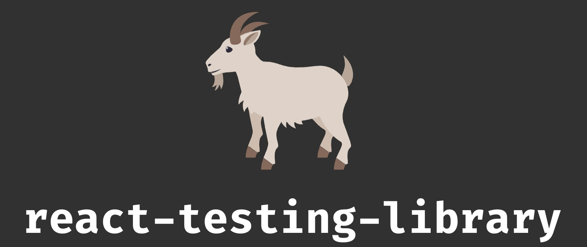

<br>
<br>


# ⚒️  `CI/CD 를 알아보자 (at React)`

<br>


* **정의**
* **장점**
* **Github Actions**

<br>

> 정의

<br>

&nbsp;&nbsp;`Continuous Integration / Continuous Deployment` <br>&nbsp;&nbsp;&nbsp;&nbsp;&nbsp;&nbsp;&nbsp;&nbsp;&nbsp;&nbsp;&nbsp;&nbsp;&nbsp;&nbsp;&nbsp;&nbsp;&nbsp;&nbsp;&nbsp;&nbsp;&nbsp;&nbsp;&nbsp;&nbsp;&nbsp;&nbsp;&nbsp;&nbsp;&nbsp;&nbsp;&nbsp;&nbsp;&nbsp;&nbsp;&nbsp;&nbsp;&nbsp;&nbsp;&nbsp;&nbsp;&nbsp;&nbsp;&nbsp;&nbsp;&nbsp;&nbsp;&nbsp;&nbsp;&nbsp;&nbsp;&nbsp;`or Continuous Delivery`
```
소프트웨어 개발 프로세스에서 
지속적인 통합과 배포를 의미

CI는 코드 변경사항을 빈번하게 통합
테스트하는 과정을 자동화하여 개발자들이 빠르게 피드백

CD는 CI의 결과물을 자동으로 빌드
테스트하여 안정적인 배포 가능한 상태로 유지하는 것을 의미

개발자들은 더 짧은 주기로 소프트웨어를 개발하고 배포
```

<br><br>

> 장점

<br>

- 빠른 피드백
- 안정적인 배포
- 개발 생산성 향상
- 협업 개선
- 신뢰성과 안정성

<br><br>

> Github Actions

<br>

`1 ) GitHub 저장소에 접속하여 해당 프로젝트로 이동`
<br><br>`2 ) 저장소 상단 메뉴에서 "Actions"를 클릭`
<br><br>`3 ) "Set up a workflow yourself" 옵션을 선택`
<br><br>`4 ) 원하는 workflow 파일 이름을 입력하고 "Start commit"을 클릭`
<br><br>`5 ) 생성된 workflow 파일(.github/workflows/your-workflow-file.yml)을 편집`
<br><br>`6 ) Workflow 파일은 YAML 형식으로 작성되며, jobs, steps, actions 등의 섹션을 포함합니다. 각 섹션은 원하는 작업을 정의`
<br><br>`7 ) Workflow 파일 내에서 원하는 작업을 설정합니다. 예를 들어, 빌드, 테스트, 배포 등의 단계를 포함`
<br><br>`8 ) 작업을 구성할 때에는 사용할 언어 및 프레임워크에 맞는 액션 및 스크립트를 사용합니다. GitHub Actions는 다양한 액션과 런너(runner)를 제공하므로, 필요한 도구와 작업에 맞게 선택`
<br><br>`9 ) 작업을 정의한 후, 변경 사항을 커밋하고 저장소에 푸시`
<br><br>`10 ) GitHub는 설정된 Workflow 파일을 자동으로 감지하고 실행합니다. 실행된 Workflow는 저장소의 변경 사항에 따라 지속적으로 실행`
<br><br>`11 ) 실행 결과는 Actions 탭에서 확인할 수 있으며, 빌드 및 테스트 결과, 오류 또는 경고 메시지 등이 표시`
<br><br>`12 ) 필요에 따라 더 많은 작업을 추가하거나 기존 작업을 수정하여 CI/CD 파이프라인을 확장하고 개선`
