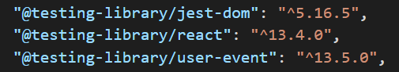

<br>
<br>


# ⚒️  `테스트코드를 알아보자 (at React)`

<br>


* **정의**
* **사용이유**
* **RTL vs Jest**
* **기능**

<br>

> 정의


```
React에서 테스트는 
React 컴포넌트가 예상대로 작동하는지 확인하기 위해 
자동화된 테스트를 작성하는 방법

본질적으로 버그와 오류가 
프로덕션에 적용되기 전에 포착하는 데 
도움이 되는 안전망을 만드는 것
```


<br>

> 사용이유

<br>

- 초기 버그 감지
- 코드 신뢰성
- 리팩토링
- 협업
- 유지보수
<br>
<br>

&nbsp;&nbsp;&nbsp;&nbsp;`초기 버그 감지`
```
더 큰 문제가 되기 전에 개발 프로세스 초기에 
버그와 오류를 발견하는 데 도움
```

<br>

&nbsp;&nbsp;&nbsp;&nbsp;`코드 신뢰성`
```
컴포넌트가 예상대로 작동하는지 확인
코드의 전반적인 신뢰성과 품질을 향상
```

<br>

&nbsp;&nbsp;&nbsp;&nbsp;`리팩토링`
```
변경 사항으로 인해 
새로운 버그가 발생하거나 
기존 기능이 손상되지 않았는지 
확인할 수 있으므로 
코드를 더 쉽게 리팩토링
```

<br>

&nbsp;&nbsp;&nbsp;&nbsp;`협업`
```
컴포넌트의 예상 동작에 대한 
명확한 사양을 제공
개발자 간의 협업을 촉진
```

<br>

&nbsp;&nbsp;&nbsp;&nbsp;`유지보수`
```
코드 변경으로 인해 
새로운 버그가 발생하거나 
기존 기능이 손상되지 않는다는 
확신을 가질 수 있으므로 
시간이 지남에 따라 코드를 
더 쉽게 유지 관리
```


<br>

> React Test Library

<br>

- CRA
- RTL vs Jest
    - RTL
    - Jest

<br>


&nbsp;&nbsp;&nbsp;&nbsp;`CRA` &nbsp;&nbsp; 
 Package.json 에 기본적으로 제공하는 test 라이브러리



<br>
<br>

&nbsp;&nbsp;&nbsp;&nbsp;`RTL` &nbsp;&nbsp;   컴포넌트의 UI (사용자 인터페이스) 테스트에 중점을 둔 <br> &nbsp;&nbsp;&nbsp;&nbsp;  &nbsp;&nbsp;&nbsp;  &nbsp; &nbsp;&nbsp;  React용 경량 테스트 라이브러리
```
컴포넌트 렌더링, 
사용자 상호 작용 시뮬레이션 및 결과 DOM 쿼리를 위한 
간단하고 직관적인 API를 제공

[RTL의 주요 목표]
개발자가 사용자가 컴포넌트와 상호 작용하는 방식과 
매우 유사한 테스트를 작성하도록 권장하는 것
```
<br>

[Code]

```
import { render, screen } from '@testing-library/react';
import MyComponent from './MyComponent';

test('renders correctly', () => {
  render(<MyComponent />);
  const element = screen.getByText('Hello, World!');
  expect(element).toBeInTheDocument();
});
```

<br>
<br>

&nbsp;&nbsp;&nbsp;&nbsp;`Jest` &nbsp;&nbsp;   코드 테스트를 위한 포괄적인 도구 모음을 제공하는  <br> &nbsp;&nbsp;&nbsp;&nbsp;  &nbsp;&nbsp;&nbsp;  &nbsp; &nbsp;&nbsp;&nbsp;&nbsp;  강력한 JavaScript용 테스트 프레임워크
```
[설치]
npm install --save-dev jest
yarn add --dev jest

개별 기능에서 전체 애플리케이션에 
이르기까지 모든 것을 테스트하는 데 
사용 가능 

기능 모의 및 감시, 비동기 테스트 및 
코드 범위 보고에 대한 지원을 포함
```
<br>

[Code]

```
import MyComponent from './MyComponent';

test('renders correctly', () => {
  const component = shallow(<MyComponent />);
  expect(component).toMatchSnapshot();
});
```

<br>
<br>

&nbsp;&nbsp;&nbsp;&nbsp;`RTS vs Jest` &nbsp;&nbsp;   코드 테스트를 위한 포괄적인 도구 모음을 제공하는  <br> &nbsp;&nbsp;&nbsp;&nbsp;  &nbsp;&nbsp;&nbsp;&nbsp;&nbsp;&nbsp;&nbsp;&nbsp;&nbsp;&nbsp;&nbsp;&nbsp;&nbsp;&nbsp;&nbsp;&nbsp;&nbsp;&nbsp;&nbsp;&nbsp;&nbsp;&nbsp;&nbsp;&nbsp;  강력한 JavaScript용 테스트 프레임워크

```
RTL과 Jest는 모두 React 컴포넌트의 안정성과 
품질을 보장하는 데 도움이 되는 강력한 테스트 도구
```
<br>

`RTL`
```
컴포넌트 사용자 인터페이스 테스트에 중점

컴포넌트 렌더링, 
사용자 상호 작용 시뮬레이션 및 결과 DOM 쿼리를 위한 
간단하고 직관적인 API를 제공

개발자가 사용자가 컴포넌트와 상호 작용하는 방식과 
매우 유사한 테스트를 작성하도록 권장

RTL은 종종 Jest 또는 Mocha와 같은 
다른 테스트 라이브러리와 함께 사용
```
<br>

`Jest`
```
함수에 대한 모의 및 감시, 
비동기 테스트 및 코드 범위 보고에 대한 지원을 포함하여 
코드 테스트를 위한 포괄적인 도구 모음을 제공

개별 기능에서 전체 애플리케이션에 이르기까지 
모든 것을 테스트하는 데 사용 가능

코드의 예상 동작을 쉽게 확인할 수 있는 
강력한 어설션 라이브러리가 포함

테스트 스위트 생성 및 관리를 위한 
기본 제공 지원을 제공하며 RTL과 같은 
다른 테스트 라이브러리와 함께 작동하도록 구성 가능
```

<br>

`비교`
```
RTL은 특히 React 컴포넌트의 
사용자 인터페이스 테스트에 중점을 둔 
보다 가벼운 테스트 라이브러리

반면 Jest는 코드의 
모든 측면을 테스트하는 데 사용할 수 있는 
보다 포괄적인 테스트 프레임워크
```

<br>


> 기능


<br>

&nbsp;&nbsp;&nbsp;&nbsp;`RTL` 
```
[render 기능]
    React 컴포넌트를 렌더링하는 데 사용

    DOM을 쿼리하고 컴포넌트와 상호 작용하기 위한
    렌더링된 컴포넌트 및 유틸리티 기능을 나타내는 
    속성이 있는 개체를 반환
    

[screen 개체] 
    이 개체는 렌더링된 DOM 요소를 
    쿼리하기 위한 유틸리티 기능을 제공


[사용자 상호 작용 시뮬레이션] 
    클릭을 시뮬레이션하는 'fireEvent.click'과 
    같은 컴포넌트와의 사용자 상호 작용을 
    시뮬레이션하는 기능을 제공


[액세스 가능한 쿼리]    
    렌더링된 DOM에서 요소를 찾기 위해 
    ARIA 역할 및 레이블을 사용하는 
    일련의 쿼리 기능을 제공
    
    이렇게 하면 장애가 있는 사용자가 액세스할 수 있는 테스트를 더 쉽게 작성 가능


[테스트 ID] 
    테스트용 컴포넌트의 요소를 
    고유하게 식별하기 위해 
    테스트 ID를 사용할 것을 권장
    
    컴포넌트의 특정 구현 세부 정보에서 
    테스트를 분리하는 데 도움
```
<br>

&nbsp;&nbsp;&nbsp;&nbsp;`Jest` 
```
[test 함수]
    코드에 대한 개별 테스트 사례를 
    정의하는 데 사용
    
    테스트에 대한 설명과 
    테스트 코드를 포함하는 콜백 함수가 필요
    

[모의 기능]
    코드의 기능을 모의
    염탐할 수 있는 강력한 도구를 제공
    
    애플리케이션의 다른 부분 간의 복잡한 상호 작용을 
    더 쉽게 테스트 가능


[비동기 테스트] 
    async/await 또는 done 콜백을 사용
    비동기 테스트를 지원하므로 
    
    API 호출이나 시간 초과와 같은 
    비동기 작업에 의존하는 코드를 
    쉽게 테스트


[스냅샷 테스트] 
    컴포넌트의 렌더링된 출력의 직렬화된 표현을 생성
    이를 컴포넌트의 향후 버전과 비교
    
    시간이 지남에 따라 일관성을 유지하도록 하는 
    스냅샷 테스트 지원이 포함

    
[코드 커버리지 보고]
    코드 커버리지 보고서 생성을 위한 
    내장 지원이 포함되어 있어 
    
    적절하게 테스트되지 않은 코드베이스 영역을 
    식별하는 데 도움
```
<br>
