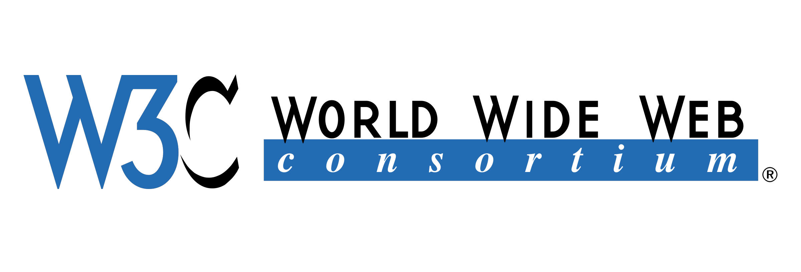

<br>
<br>


# ⚒️  `CSS3 알아보자`

<br>


* **주요 기술**
* **예시 코드**

<br>

> 주요 기술

- 그리드 레이아웃
- 트랜지션과 애니메이션
- 폰트와 텍스트 스타일링

<br>

&nbsp;&nbsp;&nbsp;`그리드 레이아웃`
```
웹 페이지의 구조와 레이아웃을 
보다 유연하게 조정 가능 

반응형 디자인을 더욱 효과적으로 구현
```

<br>

&nbsp;&nbsp;&nbsp;`트랜지션과 애니메이션`
```
웹 요소에 다양한 움직임과 
전환 효과를 적용 가능

사용자 인터랙션을 부드럽게 만들어 
사용자 경험을 향상
```

<br>

&nbsp;&nbsp;&nbsp;`폰트와 텍스트 스타일링`
```
특정 폰트를 웹 페이지에 적용

텍스트 그림자, 텍스트 그라데이션 등의 
효과를 쉽게 적용
```

<br>

> 예시 코드

<br>

- 그리드 레이아웃
- 트랜지션과 애니메이션
- 폰트와 텍스트 스타일링

<br>

&nbsp;&nbsp;&nbsp;`그리드 레이아웃`
```css
.container {
  display: grid;
  grid-template-columns: 1fr 1fr 1fr;
  grid-gap: 10px;
}

.item {
  background-color: #f2f2f2;
  padding: 20px;
}
```

<br>

&nbsp;&nbsp;&nbsp;`트랜지션과 애니메이션`
```css
.box {
  width: 100px;
  height: 100px;
  background-color: red;
  transition: width 0.5s, height 0.5s, background-color 0.5s;
}

.box:hover {
  width: 200px;
  height: 200px;
  background-color: blue;
}

@keyframes move {
  0% {
    transform: translateX(0);
  }
  50% {
    transform: translateX(100px);
  }
  100% {
    transform: translateX(0);
  }
}

.animated-box {
  animation: move 3s infinite;
}
```

<br>

&nbsp;&nbsp;&nbsp;`폰트와 텍스트 스타일링`
```css
@font-face {
  font-family: 'CustomFont';
  src: url('custom-font.woff2') format('woff2');
}

.text {
  font-family: 'CustomFont', sans-serif;
  text-shadow: 2px 2px 4px #000;
  background: linear-gradient(to right, #ff0000, #00ff00);
  -webkit-background-clip: text;
  -webkit-text-fill-color: transparent;
}
```