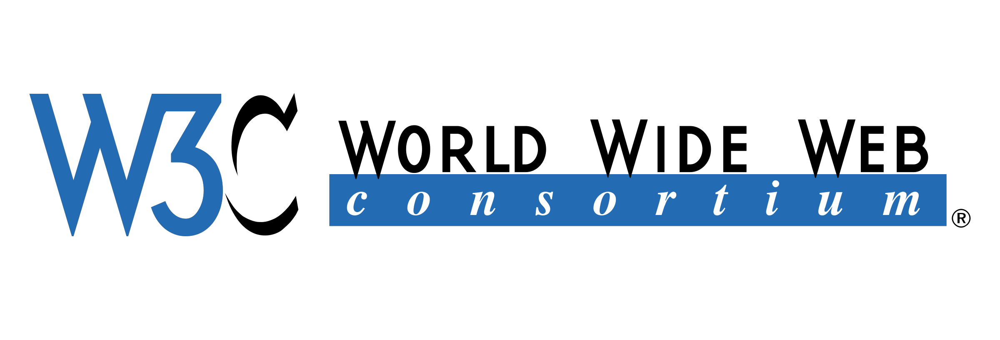

<br>
<br>


# ⚒️  `W3C 알아보자`

<br>


* **정의**
* **설명**
* **권장**

<br>

> 정의


```
웹 기술의 표준화와 웹의 발전을 촉진하기 위한 
국제 표준화 기구
```

<br>

> 설명

<br>

- W3C의 역할
- 웹 표준의 중요성
- 웹 표준의 구성

<br>

&nbsp;&nbsp;&nbsp;`W3C의 역할`
```
다양한 전문가 그룹과 회원 기업들과의 협력을 통해 
웹 기술의 표준을 개발하고 유지 관리

W3C는 웹의 보안, 접근성, 퍼포먼스, 
다국어 지원 등의 측면에서 표준을 개발

웹의 통합성과 상호 운용성을 증진
```

<br>

&nbsp;&nbsp;&nbsp;`웹 표준의 중요성`
```
웹 페이지와 웹 애플리케이션의 
개발과 운영에서 중요한 역할

표준을 준수함으로써 
웹 페이지는 다양한 브라우저와 디바이스에서 
일관된 방식으로 동작

웹 개발자는 크로스 브라우징과 호환성 문제를 최소화
```

<br>

&nbsp;&nbsp;&nbsp;`웹 표준의 구성`
```
HTML, CSS, JavaScript와 같은 핵심 기술과 
웹 API, 웹 보안, 웹 접근성, 마이크로 데이터 등 
다양한 측면을 포함
```

<br>
<br>

> 권장

<br>

- 표준 준수
- 크로스 브라우징 
- 접근성 고려
- 성능 최적화
- 모바일 최적화
- 테스팅과 품질 관리
- 지속적인 학습과 업데이트

<br>

&nbsp;&nbsp;&nbsp;&nbsp;`표준 준수` 
```
W3C에서 제정한 웹 표준을 준수
HTML, CSS, JavaScript의 최신 버전 및 
권고 사양을 따르는 것이 중요
```
<br>

&nbsp;&nbsp;&nbsp;&nbsp;`크로스 브라우징` 
```
다양한 브라우저에서 웹 페이지가 
일관되게 동작하도록 테스트하고 대응

브라우저별로 지원되는 기능과 동작의 차이를 이해
CSS 프리픽스(prefix)를 사용하여 호환성을 유지
```
<br>

&nbsp;&nbsp;&nbsp;&nbsp;`접근성 고려` 
```
모든 사용자가 웹 페이지에 
접근하고 사용할 수 있도록 접근성을 고려

웹 접근성 가이드라인을 준수하고, 
시각, 청각, 운동 능력 등 다양한 장애를 가진 
사용자들을 고려한 웹 페이지를 제공
```
<br>

&nbsp;&nbsp;&nbsp;&nbsp;`성능 최적화` 
```
웹 페이지의 로딩 속도와 성능을 최적화

이미지 최적화, 캐싱, 자바스크립트 번들링 등을 통해 
페이지의 로딩 시간을 단축
사용자 경험을 향상
```
<br>

&nbsp;&nbsp;&nbsp;&nbsp;`모바일 최적화` 
```
모바일 장치에서의 웹 사용이 증가중, 
반응형 디자인이나 모바일 최적화 기술을 사용

모바일 환경에서도 
웹 페이지가 잘 표시되고 사용하기 편리
```
<br>

&nbsp;&nbsp;&nbsp;&nbsp;`테스팅과 품질 관리` 
```
테스트를 통해 웹 페이지의 품질을 관리

크로스 브라우징 테스트, 
기능적인 테스트, 사용자 경험 테스트 등을 수행

웹 페이지의 오류를 최소화하고 품질을 향상
```
<br>

&nbsp;&nbsp;&nbsp;&nbsp;`지속적인 학습과 업데이트` 
```
웹 기술은 지속적으로 진화하고 변화

새로운 기술과 트렌드를 학습하고 업데이트 필요
최신의 웹 개발 지식을 습득

개발 커뮤니티와 참고 자료를 활용하여 
지속적인 학습을 추구
```