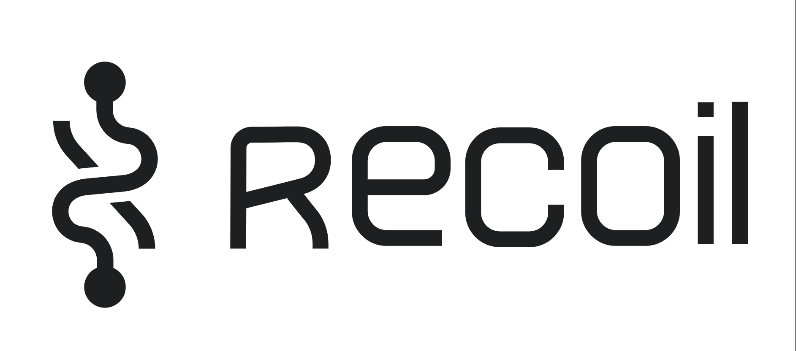

<br>
<br>


# ⚒️  `Recoil 알아보자`

<br>


* **주요 기술**
* **예시 코드**

<br>

> 주요 기술

- 시맨틱 태그
- 멀티미디어 지원
- 웹 폼 개선

<br>

&nbsp;&nbsp;&nbsp;`시멘틱 태그`
```
시맨틱 태그(semantic tags)가 도입

이러한 태그들은 콘텐츠의 의미
명확하게 표현 가능 

검색 엔진 최적화(SEO)를 개선
웹 접근성을 향상


[종류]

<header> 
    ㄴ> 문서의 헤더
        로고, 제목, 검색 폼 등을 포함
    
<nav>
    ㄴ> 문서의 탐색 링크를 그룹화
        메뉴, 링크 목록 등을 포함
    
<main>
    ㄴ> 문서의 주요 콘텐츠
        한 페이지에 하나의 
        <main> 요소만 사용 가능

<article>
    ㄴ> 독립적인 콘텐츠
        뉴스 기사, 블로그 글, 
        포럼 게시물 등을 포함

<section>
    ㄴ> 문서의 구획
        관련된 콘텐츠 그룹을 나눌 때 사용
        
<aside>
    ㄴ> 주요 콘텐츠와는 관련이 적은 보조 콘텐츠
        사이드바, 광고 등을 포함
        
<footer>
    ㄴ> 문서의 푸터
        저작권 정보, 연락처 등을 포함

```

<br>

&nbsp;&nbsp;&nbsp;`멀티미디어 지원`
```
오디오, 비디오, 캔버스(canvas), 
SVG 등의 멀티미디어 요소와 
기능이 추가

이를 통해 웹 페이지에서 멀티미디어 콘텐츠를 더욱 쉽게 삽입하고 제어


[종류]

    
        ㄴ> 이미지를 삽입
            src 속성을 통해 이미지 경로 지정
            
    <video>
        ㄴ> 동영상을 삽입, src 속성 통해 
            비디오 파일 경로를 지정 가능 
            
            <source> 요소를 사용하여 
            다양한 형식의 비디오를 지정 가능

    <audio>
        ㄴ> 오디오 파일을 삽입, src 속성 통해 
            오디오 파일 경로를 지정할 가능 
        
            <source> 요소를 사용하여 
            다양한 형식의 오디오를 지정 가능

    <canvas>
        ㄴ> 스크립트를 사용, 
            그래픽을 그리기 위한 영역을 생성
        
            JavaScript를 통해 그림을 그리거나 
            애니메이션을 생성 가능
```

<br>

> 예시 코드

<br>

- 시맨틱 태그
- 멀티미디어 지원
- 웹 폼 개선

<br>

&nbsp;&nbsp;&nbsp;`시멘틱 태그`
```html
<header>
  <h1>Website Title</h1>
</header>

<main>
  <article>
    <h2>Article Title</h2>
    <p>Article content goes here...</p>
  </article>
</main>

<footer>
  <p>&copy; 2023 Example Company</p>
</footer>
```

<br>

&nbsp;&nbsp;&nbsp;`멀티미디어 지원`
```html
<audio controls>
  <source src="audio-file.mp3" type="audio/mpeg">
  Your browser does not support the audio tag.
</audio>

<video controls>
  <source src="video-file.mp4" type="video/mp4">
  Your browser does not support the video tag.
</video>

<canvas id="myCanvas"></canvas>
```

<br>

&nbsp;&nbsp;&nbsp;`웹 폼 개선`
```html
<form>
  <label for="name">Name:</label>
  <input type="text" id="name" required>

  <label for="email">Email:</label>
  <input type="email" id="email" required>

  <input type="submit" value="Submit">
</form>
```