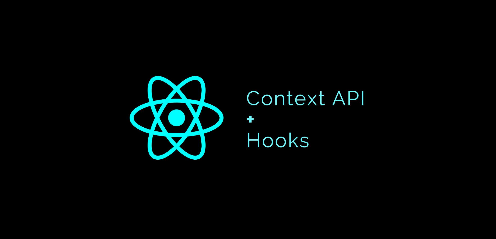

<br>
<br>


# ⚒️  `useContext 알아보자`

<br>


* **정의**
* **사용법**
* **최적의 사용법**

<br>


> 정의

```
React의 훅

React 컴포넌트 내에 전역으로 데이터 공유
접근할 수 있는 방법을 제공

주로 상태 관리나 테마, 언어 설정 등 
전역적인 상태를 공유할 때 사용

라이브러리 없이도 
간단한 상태 관리를 할 수 있는 방법을 제공
```
<br>

> 사용법
```
useContext를 사용하려면 
-> 먼저 React의 createContext 함수를 사용
-> 컨텍스트 객체를 생성

createContext 함수는 
컨텍스트 객체와 함께 Provider 컴포넌트를 반환

Provider 컴포넌트를 사용하여 값을 제공

해당 값을 소비하는 컴포넌트에서 
useContext를 통해 값을 받음
```
<br>

```javascript
// 상태를 관리할 컨텍스트 객체 생성
const MyContext = React.createContext();

// Provider 컴포넌트를 사용하여 값을 제공
function App() {
  const sharedValue = "Hello, useContext!";
  
  return (
    <MyContext.Provider value={sharedValue}>
      <ChildComponent />
    </MyContext.Provider>
  );
}

// 값을 소비하는 컴포넌트에서 useContext로 값 가져오기
function ChildComponent() {
  const value = useContext(MyContext);
  
  return <p>{value}</p>;
}
```

<br>
<br>


> 최적의 사용법

```
작은 규모의 애플리케이션이나 
단순한 상태 공유에 유용

하지만 useContext는 단일 컨텍스트 객체만을 지원

---

복잡한 상태 관리가 필요한 경우

상태 관리 라이브러리(예: Redux, MobX)를 
사용하는 것이 더 적절
<br>