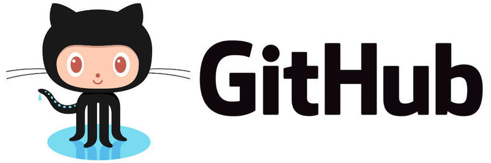

<br>
<br>


# ⚒️  `Git Study 1.0`

<br>

> ### **분산 버전 관리 시스템**

<br>

- **`장점`**
    - 빠른 응답성
    - 브랜치 관리의 편리함

    ```
    혼자 사용할 때도 협업 할 때도 BEST !!
    ```

- **`정보`**
    - MS 가 Github 를 인수
    - 리눅스 창시자가 리눅스의 소스 코드를 관리하기 위해 만듦
        - 리눅스의 철학을 담음

<br>

- **`사용법`**

    - 다른 커밋 이동   
    ```
    
    // commit 96a3ee5 ~ : 두 번째 커밋
    // commit 5813bb5 ~ : 첫 번째 커밋

    git log 
    git checkout 5813bb5
    ```
    ```
    0. 커밋 로그 확인
    1. 앞 7자리 커밋 아이디를 복사
    2. checkout 명령어로 해당 커밋으로 코드 되돌림
        (전체 id 도 가능) 
    3. Head is now at 5813bb5 첫 번째 커밋 
        (이 문구가 보이면 성공)  

        tip ) git checkout - // 최신 커밋으로 이동 
    ```
    <br>

    - 원격 저장소 생성 후 연결하기
    ```
    git remote add origin 레포지터리-주소
    git push origin master
    ```

    ```
    1. 메뉴에 New Repository 클릭
    2. Repository 정의
    3. Create Repository 클릭
    4. Repository 주소 복사
    5. git remote add origin 명령어에 원격저장소 주소 이어서 입력
    6. git push origin master 명령어로 로그인

        tip ) git 과 github 는 다른 단체
                - git 에서 프로젝트 생성 시 master 브랜치 기본
                    (git init 도 마찬가지)
                - github 에서 프로젝트 생성 시 main 브랜치 기본 
    ```
    <br>

    - 원격 저장소의 커밋을 로컬 저장소로 내려받기
    ```
    git clone 원격저장소-주소 .
    ```

    ```
    1. Clone or download 클릭
    2. 주소 복사
    3. git clone 에 원격저장소-주소 이어서 입력
        ㄴ> 이어서 한 칸 띄고 마침표

        after ) 소스 코드 업데이트 시
                git add .
                git commit -m "update"
                git push origin master

                ㄴ> 원격 저장소에 커밋 됨 
    ```
   <br>

    - 원격 저장소의 새로운 커밋을 로컬 저장소로 갱신
    ```
    git pull origin master
    ```

    ```
    1. git pull origin master
    ```


<br>

- **`용어 정리`**

    - Git  
        - 깃, 버전 관리 시스템
    - Github  
        - 깃허브, Git 으로 관리하는 프로젝트를 올려두는 사이트
    - GUI  
        - 그래픽 유저 인터페이스, 마우스 클릭해서 사용하는 방식
    - CLI  
        - 커맨드 라인 인터페이스, 명령어 하나씩 입력하는 방식
    - Git Bash  
        - CLI 방식으로 Git 을 사용할 수 있는 환경
    - Commit  
        - 버전 관리를 통해 생성된 파일 혹은 행동
    - checkout  
        - 원하는 지점으로 이동
    - 푸시
        - 로컬 저장소의 커밋 => 원격 저장소에 업로드
    - 풀
        - 원격 저장소의 커밋 => 로컬 저장소에 다운로드

<br>

> Q. GUI 보다 CLI 위주로 Git 을 사용하게 되는 이유

```
A. 세세하게 제어와 작업 속도를 올리기 위해
```